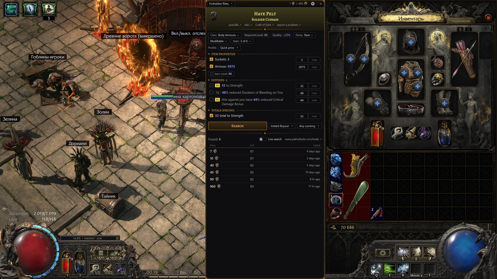

# PoE2 Oracle

**English** · [Русский](README.ru.md)

PoE2 Oracle is a price checker and XP tracker for Path of Exile 2 on Windows: native, fast and
light. It is written in Rust with [GPUI](https://github.com/zed-industries/zed/tree/main/crates/gpui)
and its interface is drawn by the graphics card through Direct3D 11, with no Electron, browser or
Overwolf inside; only signing in to pathofexile.com opens a page in Windows' own Edge component
(WebView2). In Task Manager it is one process of 39.6 MB, and it is ready to price 0.27 s after it
starts. With the game in the background, POE2 Currency Overlay, Exiled Exchange 2, Sidekick and
PoE Overlay II took 3.4 to 16.8 times as much memory on the same PC. In the game, with the mouse
moving, PoE2 Oracle used the least CPU of the four price checkers running together: 0.35% of a
core, against 0.71 to 1.97% ([how it was measured](https://oracle.pushka.biz/guide/en/performance.html)).

Hover an item in the game and press `Ctrl+E`: a panel opens next to your inventory with the item's
stats as search filters and the cheapest current listings from the official trade site. Currency
and other Currency Exchange items are priced from GGG's own hourly record of the trades made on the
exchange; poe2scout adds a chart of the week and prices uniques and exchange items that haven't
traded lately. An XP overlay right on the game's HUD, above the flask and skill panels, shows how
fast you level, how long until the next level and how long the current map has run.

The game has had a price check of its own since patch 0.5 (<kbd>Shift</kbd>+<kbd>Alt</kbd>+click):
it opens the in-game market, in town or your hideout, with every modifier of the item as a filter.
PoE2 Oracle works over the game anywhere, maps included, picks the modifiers that decide the price
for you, prices currency from the exchange's own trade record, and adds an XP overlay with a map
timer and a few quick chat actions.

The app's interface is in English and Russian: by default it follows the game client's language,
or Windows' display language until the game has run, and the settings can switch it. The game
client can be English or Russian. A short tour shows the basics on the first launch.

## Features

- **Price check.** The panel shows the item's name and art with links to poe2db, the wiki, Craft of
  Exile (for an item it can craft) and a problem report for this item, one row per stat with its
  min/max values and mod tier, and the cheapest listings on the trade site (one page of 10 per
  search): price, item level, seller and how long ago it was listed. Searches go to
  www.pathofexile.com or ru.pathofexile.com, matching the item's language. `Esc` closes the panel.
- **Craft of Exile in one click, from either client.** The panel's Craft of Exile link opens the
  item in that site's crafting simulator with base, item level, rarity, implicits and mods set.
  Craft of Exile's own import reads only English text; the link passes the game's own ids instead,
  so an item from the Russian client arrives the same as one from the English client.
- **Search profiles** set up which stats are searched and how far below your rolls, as PoE Overlay
  II's do: **Quick price** (up to four of the most valuable stats, picked by PoE Overlay II's
  scoring of tier, tags and roll), **Exact match**, **Broad −10%** and **Crafting base**. A
  modifier row's slider spans its rolls across all tiers, and its tier badge tells the item level
  the tier needs and the best tier the item's level allows. When nothing is found, the panel offers
  a broader search instead of spending the trade site's limit on its own.
- **Search chips** narrow or widen the search with one click: the item's base type or its whole
  class, its rarity (by default a magic item is compared with magic items and a rare with rare
  items; a click widens that to every non-unique item), corrupted listings in or out, every stat or
  none, which sellers to include (instant buyout only by default), and the currency of the price.
- **Whispers.** Click a listing whose seller trades in person and the trade site's whisper is copied;
  paste it into the game chat.
- **Currency Exchange items** (currency, omens, runes, essences and the like) get a market card from
  GGG's own record of the trades made on the exchange: the value in divine, exalted and chaos orbs
  for the last complete hour (up to three for a rarely traded item; the card names the hours),
  poe2scout's chart of the week, the hourly volume and what the copied stack is worth. When an item
  hasn't traded in your league in the last hours (common in small leagues such as Standard), the
  panel shows poe2scout's price instead and searches the trade site only when you press
  **Trade site listings**, since every search counts against the trade site's limit. Without a
  poe2scout price either, the trade site is searched right away.
- **Waystones.** Click the ◇ at the end of a modifier to mark it as danger, caution or wanted;
  the marks are remembered and highlighted on every waystone you check.
- **Vendor gamble offers** are recognised: the panel says the item is only revealed after buying
  instead of searching for it.
- **XP overlay** on top of the game's HUD: above the flask panel, how fast you level (percent of a
  level per hour), the time to the next level and optionally the level percentage, with a ⚙ for
  the settings (in a town or hideout, or after five minutes without a gain, it dims and shows only
  the level percentage); above the skill panel, a timer for the current map.
- **Quick actions:** your own hotkeys that type a chat command (`/hideout`, `@last thanks`) or a
  stash search string (for example one made with poe2.re).
- **Sign-in to pathofexile.com**, optional, on the site's own page: it opens private leagues and
  **sum** rows (a stat added up across mods). The account's private leagues join the league menus
  by themselves, looked up again hourly by default while you're signed in, or at once with
  **Refresh**.
- **Automatic updates** from oracle.pushka.biz: the app stays connected, and a new version or new
  game data (the tables it reads items with) installs by itself within minutes of its release,
  once none of the app's windows is open; a plate over the game says so after the restart.
  Nothing runs unless the release's Ed25519 signature on `SHA256SUMS` checks out and the file
  matches its SHA-256 there, so no one on the way can hand you another installer. **Update
  automatically** in the settings turns it off, connection and all.
- **Reports to the developer** from a window of the app, no account needed: a problem or an idea,
  or what's wrong with an item's price or reading, with the item's text attached, and the
  diagnostics report if you choose. After a crash, the next launch opens this window with what the
  app reported attached.

## Requirements

- Windows 10 or 11, 64-bit; no .NET or Visual C++ Redistributable needed.
- Path of Exile 2 in **Windowed Fullscreen** or **Windowed** mode. The panel can't be shown over
  exclusive Fullscreen; the app's settings window warns you about it.
- An English or Russian game client.
- Internet access to pathofexile.com, web.poecdn.com and poe2scout, and to oracle.pushka.biz for
  updates and the reports you send.

## Install

1. Download `PoE2-Oracle-Setup-<version>.exe` from the
   [PoE2 Oracle site](https://oracle.pushka.biz/).
2. Run it. It installs for your Windows user only, without administrator rights, into
   `%LOCALAPPDATA%\Programs\PoE2 Oracle` and adds a Start menu shortcut. The last page offers to
   start the app and to start it with Windows. Started from there, the app opens its settings with
   a welcome over them: it's installed and running, where to find it from now on, how to check a
   price, and whether it starts with Windows.
3. The installer isn't code-signed yet, so Windows SmartScreen may show "Windows protected your
   PC". Click **More info**, then **Run anyway**. To check that you have the published file, run
   `Get-FileHash .\PoE2-Oracle-Setup-<version>.exe` in PowerShell and compare the result with the
   latest release's `SHA256SUMS`, `https://oracle.pushka.biz/download/v<version>/SHA256SUMS` (the
   site serves only the latest release's files).

To uninstall, open Windows Settings → Apps → Installed apps (Apps & features on Windows 10) →
PoE2 Oracle → Uninstall. Your settings and downloaded price data are kept unless you tick
**Settings and cache**.

## First run

1. A short guided tour starts in the settings window, at the league, and walks you through a first
   price check, the price panel and the XP overlay; skip it any time, and replay it from Settings →
   Help → **Tutorial**. The app runs in the background: its icon is in the notification area next
   to the clock, sometimes behind the "Show hidden icons" arrow. A click on it opens the settings;
   its right-click menu has **Settings** and **Quit**. **Where to show the app** in Settings →
   General puts a taskbar button in its place, or shows both.
2. In the game's graphics options, set the display mode to Windowed Fullscreen.
3. Hover an item in the game and press `Ctrl+E`. Right after the first launch the app spends a few
   seconds downloading the trade site's catalogs; until then the panel says "Loading trade site
   data…".

Good to know:

- The hotkeys work only while the game (or the price panel) is in front, so `Ctrl+E` stays free in
  other programs. You can change it in the settings.
- To read an item, the app presses the game's own advanced copy, `Ctrl+Alt+C`, and puts your
  clipboard back afterwards. If another program (a graphics card overlay, a screen recorder,
  Discord) has taken that combination, price checks can't work; the settings window tells you.
- One copy runs at a time. Starting it again opens the settings.

## User guide

The full guide, with every setting explained, is at
**[oracle.pushka.biz/guide](https://oracle.pushka.biz/guide/)**:
[introduction](https://oracle.pushka.biz/guide/en/introduction.html),
[troubleshooting](https://oracle.pushka.biz/guide/en/troubleshooting.html) and
[privacy](https://oracle.pushka.biz/guide/en/privacy.html). The project site is
[oracle.pushka.biz](https://oracle.pushka.biz/).

## Reporting a problem

The quickest way is from the app itself: it opens a report window, and what you write there goes
to the developer through oracle.pushka.biz. You don't need an account; leave a contact (Telegram,
Discord or email) if you'd like an answer.

- **Write to the developer** in the **Help** section of the settings, for a problem or an idea.
  With **Attach diagnostics** on (the default for a problem), the report carries the logs,
  settings, the item texts the app couldn't read and a summary of the system, with your Windows
  user name and folders hidden; **What's inside** saves the same zip to your desktop, so you can
  look first.
- The link **report a problem** under the item name on the price panel, or the button
  **Report a problem** in the message about an item the app couldn't read, opens the window for
  that item, with its text attached.
- After a crash, the next launch opens the window by itself, with what the app reported attached.

[Reporting a problem](https://oracle.pushka.biz/guide/en/report.html) in the guide tells what each
report carries. Without the app, use the form on the site,
[oracle.pushka.biz/report.html](https://oracle.pushka.biz/report.html), for a problem or an idea:
mention the app version (Windows Settings → Apps → Installed apps shows it) and your game client
language, and for an item paste its text (hover it in the game, press `Ctrl+Alt+C`). Never put
passwords or session cookies in a report. For security problems, see [SECURITY.md](SECURITY.md).

If searches stop with "The trade site has limited searches for a while", you have hit the trade
site's limit on requests from one IP address, which is shared with the trade site open in your
browser. After the site refuses a request, the app sends it nothing until the lockout ends: wait
for the time the panel shows and try again. Currency Exchange prices keep working meanwhile.

## Privacy

PoE2 Oracle has no telemetry and no accounts of its own. It connects to:

| Where | What for |
|---|---|
| www.pathofexile.com, ru.pathofexile.com | The trade site's API: leagues, stat and item catalogs, your searches (the item's stats) and the listings they find. Once you sign in, the site's session goes along, and the app also reads your account page (to check the sign-in) and your private leagues' pages on www.pathofexile.com |
| api.poe2scout.com | Prices of uniques; the week's prices and pages of Currency Exchange items, and prices of those that haven't traded in your league lately |
| web.poecdn.com | Item images, and GGG's hourly record of the trades made on the Currency Exchange (one file per hour for all leagues, the same for everyone) |
| oracle.pushka.biz | PoE2 Oracle's own service. While **Update automatically** is on (the default): a connection kept open from about 10 seconds after start for as long as the app runs, which carries only the app's version (its User-Agent), so the service sees your IP address meanwhile; and the downloads of a new installer or game data pack with their signed checksums. The service counts connections, checks and downloads per day, with no id. A report, only when you send one: your text, the contact if given, the app's version, languages, Windows version, league and interface scale, the item's name and text or the crash text when attached, and the diagnostics report when **Attach diagnostics** is on. The service keeps no copy: it passes the report on to the developer as an issue in the project's private GitHub repository and a Telegram message, the diagnostics report to Telegram only |

Signing in is optional. It happens on pathofexile.com's own page, in a window of the app (Microsoft
Edge WebView2); PoE2 Oracle doesn't read or keep your password, only the site's session.

Everything else stays on your computer, unless it goes into a report you send. The app reads the
item text the game copies, the game's own log (`Client.txt`: level-ups, area changes), the game's
settings file and, on the screen, the pixels of the experience bar and of thin strips along the top
of the flask and skill panels, where the XP overlay's plates sit (to see when a tooltip covers
them), more often while you use the mouse or the keyboard, which it notes without reading the keys
or where the pointer goes. It keeps its files here:

| What | Where |
|---|---|
| Settings | `%APPDATA%\poe2-oracle\config\settings.json` |
| Logs of this run and the previous one | `%LOCALAPPDATA%\poe2-oracle\data\logs` |
| Item texts it couldn't read | `%LOCALAPPDATA%\poe2-oracle\data\unparsed` |
| What the app reported about its last crash, until you send or close that report | `%LOCALAPPDATA%\poe2-oracle\data\crash\last-crash.txt` |
| Which update the app just made, until the next start has said so | `%LOCALAPPDATA%\poe2-oracle\data\last-update.json` |
| Downloaded catalogs, prices and updates | `%LOCALAPPDATA%\poe2-oracle\cache` |
| The installed game data pack, and the last damaged one set aside | `%LOCALAPPDATA%\poe2-oracle\data\game-data` |
| The pathofexile.com session, once you sign in | Windows Credential Manager, `PoE2 Oracle/pathofexile.com`; **Sign out** in the settings or uninstalling removes it |

The diagnostics report is made only when you ask for it, and it leaves your computer only in a
report you send with **Attach diagnostics** on. Links on the panel (poe2db, the wiki, Craft of
Exile, poe2scout, the trade site) open in your browser when you click them. The Craft of Exile link
carries the item's base, item level, rarity and modifiers in its address; the app itself never
contacts poe2db, the wiki or Craft of Exile.

## Contributing

Bug reports and item texts that the app gets wrong are welcome: send them from the app, see
[Reporting a problem](#reporting-a-problem). See [CONTRIBUTING.md](CONTRIBUTING.md) for the rules
and how to build the app, and [CHANGELOG.md](CHANGELOG.md) for what changed between versions.

## License and disclaimer

PoE2 Oracle is licensed under either of the [MIT License](LICENSE-MIT) or the
[Apache License 2.0](LICENSE-APACHE), at your option. It includes item and stat data derived from
[Exiled Exchange 2](https://github.com/Kvan7/Exiled-Exchange-2) (MIT) and from Path of Exile 2's
own mod and base item tables as exported by [RePoE](https://repoe-fork.github.io/poe2/) (MIT; the
data belongs to Grinding Gear Games), and the Philosopher and Alegreya SC fonts (SIL Open Font
License 1.1); the installer puts the full third-party notices next to the app as
`THIRD-PARTY-NOTICES.html`.

PoE2 Oracle is a fan-made tool. This product isn't affiliated with or endorsed by Grinding Gear
Games in any way. Path of Exile is a trademark of Grinding Gear Games.
