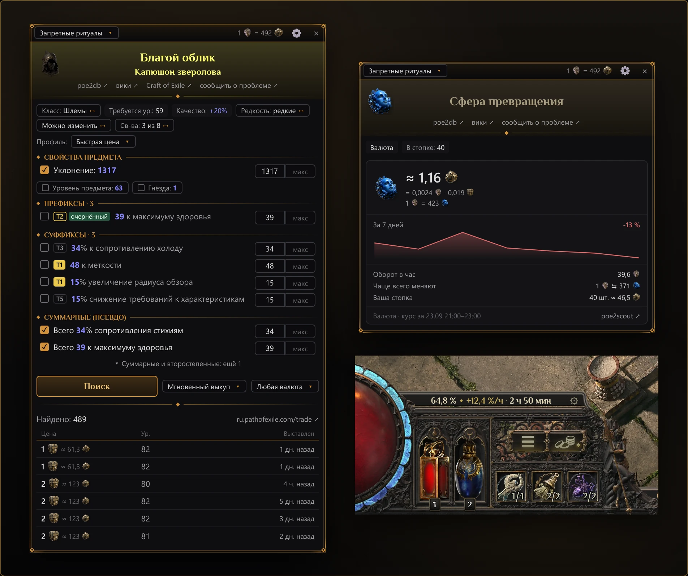

# PoE2 Oracle

[English](README.md) · **Русский**

PoE2 Oracle — программа для проверки цен и отслеживания опыта в Path of Exile 2 на Windows:
нативная, быстрая и лёгкая. Она написана на Rust с
[GPUI](https://github.com/zed-industries/zed/tree/main/crates/gpui), интерфейс рисует видеокарта
через Direct3D 11, а Electron, браузера и Overwolf внутри нет; только вход на pathofexile.com
открывает страницу во встроенном в Windows компоненте Edge (WebView2). В диспетчере задач это один
процесс примерно на 50 МБ, и оценивать предметы она готова через 0,27 с после запуска.
Exiled Exchange 2, Sidekick и PoE Overlay II, измеренные рядом с ней на том же ПК, заняли в
2,8–13 раз больше памяти ([как мерили](https://oracle.pushka.biz/guide/ru/performance.html)).

Наведите курсор на предмет в игре и нажмите `Ctrl+E`: рядом с инвентарём откроется панель, где
свойства предмета превращены в фильтры поиска, а ниже — самые дешёвые лоты с официального сайта
торговли. Валюту и другие товары валютной биржи программа оценивает по часовым сводкам сделок
биржи от самой GGG, а poe2scout добавляет график за неделю и цены уникальных предметов и товаров
биржи, которые последние часы не меняли. Оверлей опыта прямо в интерфейсе игры, над панелями
флаконов и умений, показывает, как быстро вы качаетесь, сколько осталось до следующего уровня и
сколько идёт текущая карта.

В самой игре с версии 0.5 есть своя проверка цены (<kbd>Shift</kbd>+<kbd>Alt</kbd>+щелчок): она
открывает рынок игры, в городе или убежище, с фильтрами по всем модификаторам предмета. PoE2
Oracle работает поверх игры где угодно, в том числе в картах, сам выбирает модификаторы, от которых
зависит цена, оценивает валюту по сводкам сделок самой биржи, а ещё ведёт оверлей опыта с таймером
карты и умеет быстрые действия в чате.

Интерфейс программы — на русском и английском: по умолчанию он на языке клиента игры, а пока игра
ни разу не запускалась, — на языке Windows; в настройках его можно переключить. Клиент игры может
быть русским или английским. При первом запуске короткое обучение покажет главное.

## Возможности

- **Проверка цены.** На панели — название и картинка предмета со ссылками на poe2db, вики, Craft of
  Exile (для предмета, который можно крафтить) и сообщение о проблеме с этим предметом, по строке
  на каждое свойство с полями «мин» и «макс» и тиром модификатора, а также самые дешёвые лоты с
  сайта торговли (одна страница из 10 лотов на поиск): цена, уровень предмета, продавец и когда
  выставлен лот. Поиск идёт на www.pathofexile.com или ru.pathofexile.com, в зависимости от языка
  предмета. `Esc` закрывает панель.
- **Craft of Exile в один клик — и с русским клиентом.** Ссылка «Craft of Exile» на панели
  открывает предмет в симуляторе крафта сразу с базой, уровнем предмета, редкостью, собственными
  свойствами и модификаторами. Собственный импорт Craft of Exile читает только английский текст, а
  ссылка передаёт внутренние id игры, поэтому предмет из русского клиента приходит так же, как из
  английского.
- **Профили поиска** задают, какие свойства искать и насколько ниже ваших значений, как у PoE
  Overlay II: «Быстрая цена» (до четырёх самых ценных свойств по оценке тира, тегов и ролла),
  «Точное совпадение», «Широкий −10 %» и «База для крафта». У строки модификатора есть ползунок со
  всеми роллами всех тиров, а плашка тира подсказывает, с какого уровня предмета этот тир и какой
  тир для предмета лучший из доступных. Если ничего не нашлось, панель предлагает поиск пошире, а
  не тратит лимит сайта торговли сама.
- **Переключатели поиска** одним щелчком сужают или расширяют поиск: только эта база или весь
  класс предметов, редкость (по умолчанию волшебный предмет сравнивается с волшебными, а редкий —
  с редкими; щелчок расширяет сравнение до всех, кроме уникальных), учитывать ли осквернённые лоты,
  все свойства или ни одного, каких продавцов искать (по умолчанию только мгновенный выкуп) и в
  какой валюте должна быть цена.
- **Сообщение продавцу.** Щелчок по лоту продавца, который торгует лично, копирует готовое
  сообщение с сайта торговли — остаётся вставить его в чат игры.
- **Товары валютной биржи** (валюта, знамения, руны, сущности и тому подобное) получают карточку
  рынка по сводкам сделок биржи от GGG: стоимость в божественных сферах, сферах возвышения и хаоса
  за последний полный час (для редко меняемых — до трёх часов, карточка показывает, за какие),
  график poe2scout за неделю, объём торгов в час и цену скопированной стопки. Если предмет в вашей
  лиге последние часы не меняли (так бывает в небольших лигах вроде Standard), панель показывает
  цену с poe2scout, а на сайте торговли ищет только по кнопке «Лоты на площадке»: каждый поиск
  расходует лимит запросов сайта. Если нет и цены poe2scout, поиск на сайте торговли идёт сразу.
- **Путевые камни.** Щёлкните по ◇ в конце модификатора, чтобы пометить его: «опасно», «осторожно»
  или «желанно»; пометки запоминаются и подсвечиваются на каждом проверенном камне.
- **Ставки у торговца** распознаются: вместо поиска панель сообщает, что предмет станет известен
  только после покупки.
- **Оверлей опыта** поверх интерфейса игры: над панелью флаконов — скорость прокачки (процент
  уровня в час), время до следующего уровня и по желанию процент уровня, а ещё ⚙ для настроек (в
  городе, в убежище и после пяти минут без опыта строка тускнеет и показывает только процент
  уровня); над панелью умений — таймер текущей карты.
- **Быстрые действия** — свои горячие клавиши, которые отправляют в чат команду (`/hideout`,
  `@last спасибо`) или вставляют строку поиска в тайник (например, составленную на poe2.re).
- **Вход на pathofexile.com** — по желанию, на странице самого сайта: он открывает приватные лиги
  и строки «сумма» (свойство, сложенное из нескольких модификаторов). Приватные лиги аккаунта сами
  попадают в меню лиг: пока вы вошли, они проверяются по умолчанию раз в час, а кнопкой «Обновить»
  — сразу.
- **Автоматические обновления** с oracle.pushka.biz: программа держит с ним связь, и новая версия
  или новые данные игры (таблицы, по которым она читает предметы) ставятся сами в течение
  нескольких минут после выхода — когда ни одно окно программы не открыто; после перезапуска об
  этом говорит плашка поверх игры.
  Ничего не запускается, если подпись Ed25519 выпуска под `SHA256SUMS` неверна или файл не совпадает
  с записанной там суммой SHA-256, — так никто по дороге не подсунет другой установщик. «Обновлять
  автоматически» в настройках выключает это вместе со связью.
- **Сообщения разработчику** из окна программы, без учётной записи: о проблеме, с идеей или о том,
  что не так с ценой или разбором предмета, — с текстом предмета, а по желанию и с отчётом
  диагностики. После вылета следующий запуск сам откроет это окно, и то, что сообщила программа,
  уже будет приложено.

## Что нужно

- Windows 10 или 11, 64-битная; ни .NET, ни распространяемый пакет Visual C++ не нужны.
- Path of Exile 2 в режиме экрана **«Оконный полноэкранный»** или **«Оконный»**. Поверх режима
  «Полноэкранный» панель не видна — окно настроек программы об этом предупредит.
- Русский или английский клиент игры.
- Доступ в интернет к pathofexile.com, web.poecdn.com и poe2scout, а для обновлений и ваших
  сообщений разработчику — к oracle.pushka.biz.

## Установка

1. Скачайте `PoE2-Oracle-Setup-<версия>.exe` с
   [сайта PoE2 Oracle](https://oracle.pushka.biz/ru/).
2. Запустите его. Программа устанавливается только для вашего пользователя Windows, без прав
   администратора, в папку `%LOCALAPPDATA%\Programs\PoE2 Oracle` и добавляет ярлык в меню «Пуск».
   На последней странице установщик предложит запустить программу и запускать её вместе с Windows.
   Запущенная оттуда, программа откроет настройки с приветствием поверх них: она установлена и
   работает, где её теперь искать, как проверить цену и запускается ли она вместе с Windows.
3. Установщик пока не подписан цифровой подписью, поэтому SmartScreen может показать окно «Система
   Windows защитила ваш компьютер». Нажмите **«Подробнее»**, затем **«Выполнить в любом случае»**.
   Чтобы убедиться, что у вас опубликованный файл, выполните в PowerShell
   `Get-FileHash .\PoE2-Oracle-Setup-<версия>.exe` и сравните результат с файлом `SHA256SUMS`
   последнего выпуска: `https://oracle.pushka.biz/download/v<версия>/SHA256SUMS` (сайт отдаёт
   файлы только последнего выпуска).

Чтобы удалить программу, откройте Параметры Windows → Приложения → Установленные приложения
(в Windows 10 — «Приложения и возможности») → PoE2 Oracle → Удалить. Настройки и скачанные данные
о ценах сохранятся, если не отметить **«Настройки и кэш»**.

## Первый запуск

1. Начнётся короткое обучение: оно откроет окно настроек на выборе лиги и проведёт через первую
   проверку цены, панель цены и оверлей опыта; его можно пропустить, а пройти заново — в
   «Настройки» → «Помощь» → «Обучение». Программа работает в фоне: её значок — в области
   уведомлений у часов, иногда под стрелкой «Показать скрытые значки». Щелчок по значку открывает
   настройки, а в его меню (правой кнопкой) — **«Настройки»** и **«Выход»**. Строка **«Где
   показывать программу»** в «Настройки» → «Общие» ставит вместо значка кнопку на панели задач или
   показывает и то и другое.
2. В настройках графики игры выберите режим экрана «Оконный полноэкранный».
3. Наведите курсор на предмет в игре и нажмите `Ctrl+E`. Сразу после первого запуска программа
   несколько секунд скачивает каталоги сайта торговли; пока они не загрузились, панель пишет
   «Загрузка каталога…».

Полезно знать:

- Горячие клавиши работают, только пока впереди игра (или панель с ценой), поэтому в других
  программах `Ctrl+E` остаётся свободным. Сочетание можно сменить в настройках.
- Чтобы прочитать предмет, программа нажимает в игре расширенное копирование, `Ctrl+Alt+C`, а
  потом возвращает в буфер обмена то, что там было. Если это сочетание заняла другая программа
  (оверлей видеокарты, запись экрана, Discord), проверка цены работать не будет — окно настроек об
  этом скажет.
- Одновременно работает только одна копия программы. Повторный запуск открывает настройки.

## Руководство

Полное руководство с описанием всех настроек:
**[oracle.pushka.biz/guide](https://oracle.pushka.biz/guide/)** —
[введение](https://oracle.pushka.biz/guide/ru/introduction.html),
[решение проблем](https://oracle.pushka.biz/guide/ru/troubleshooting.html) и
[конфиденциальность](https://oracle.pushka.biz/guide/ru/privacy.html). Сайт проекта —
[oracle.pushka.biz/ru](https://oracle.pushka.biz/ru/).

## Если что-то не так

Быстрее всего сообщить о проблеме из самой программы: она откроет окно сообщения, и написанное там
уйдёт разработчику через oracle.pushka.biz. Учётная запись не нужна; оставьте контакт (Telegram,
Discord или почту), если хотите ответ.

- **«Написать разработчику»** в разделе «Помощь» настроек — о проблеме или с идеей. Если включено
  **«Приложить диагностику»** (для ошибки — по умолчанию), к сообщению приложатся журналы,
  настройки, тексты предметов, которые программа не смогла прочитать, и сведения о системе; имя
  пользователя Windows и пути к папкам в них скрыты. **«Что внутри»** сохранит тот же архив на
  рабочий стол — можно сначала посмотреть.
- Ссылка **«сообщить о проблеме»** под названием предмета на панели или кнопка
  **«Сообщить о проблеме»** в сообщении о предмете, который программа не смогла прочитать,
  открывает окно для этого предмета, с уже приложенным текстом предмета.
- После вылета следующий запуск сам откроет окно, и то, что сообщила программа, уже будет
  приложено.

Что уходит в каждом сообщении, рассказывает страница руководства
[«Сообщить о проблеме»](https://oracle.pushka.biz/guide/ru/report.html). Без программы пишите через
форму на сайте, [oracle.pushka.biz/ru/report.html](https://oracle.pushka.biz/ru/report.html), — о
проблеме или с идеей; укажите версию программы (она видна в Параметры Windows → Приложения →
Установленные приложения) и язык клиента игры, а если дело в предмете, вставьте его текст
(наведите курсор на предмет в игре и нажмите `Ctrl+Alt+C`). Никогда не пишите в сообщении пароли
и cookie сессии. Об уязвимостях — см. [SECURITY.md](SECURITY.md).

Если поиск перестал работать с сообщением «Сайт торговли временно ограничил поиск», вы упёрлись в
лимит сайта торговли на запросы с одного IP-адреса, общий с сайтом торговли, открытым в браузере.
После отказа сайта программа ничего ему не отправляет, пока ограничение не закончится: подождите
время, указанное на панели, и попробуйте снова. Цены валютной биржи в это время работают.

## Конфиденциальность

У PoE2 Oracle нет телеметрии и собственных учётных записей. Программа обращается к:

| Куда | Зачем |
|---|---|
| www.pathofexile.com, ru.pathofexile.com | API сайта торговли: лиги, каталоги свойств и предметов, ваши поиски (свойства предмета) и найденные лоты. После входа с ними идёт сессия сайта, а программа ещё читает на www.pathofexile.com страницу вашей учётной записи (проверить вход) и страницы ваших приватных лиг |
| api.poe2scout.com | Цены уникальных предметов; цены товаров валютной биржи за неделю, их страницы и цены тех, которые в вашей лиге последние часы не меняли |
| web.poecdn.com | Картинки предметов и часовые сводки сделок валютной биржи от GGG (по файлу на час для всех лиг, одинаковому для всех) |
| oracle.pushka.biz | Собственный сервис PoE2 Oracle. Пока включено «Обновлять автоматически» (по умолчанию включено): соединение, которое держится примерно с 10-й секунды после запуска всё время работы программы и несёт только версию программы (в User-Agent), поэтому всё это время сервис видит ваш IP-адрес; и скачивание нового установщика или пакета данных игры с подписанными контрольными суммами. Соединения, проверки и скачивания сервис считает по дням, без идентификаторов. Сообщение разработчику — только когда вы его отправляете: ваш текст, контакт (если указан), версия программы, языки, версия Windows, лига и масштаб интерфейса, название и текст предмета или текст о вылете, если они приложены, и отчёт диагностики при включённом «Приложить диагностику». Копию сервис не хранит: он передаёт сообщение разработчику — задачей в закрытом репозитории проекта на GitHub и сообщением в Telegram, а отчёт диагностики — только в Telegram |

Вход на сайт необязателен. Он проходит на странице самого pathofexile.com в окне программы
(Microsoft Edge WebView2); пароль PoE2 Oracle не читает и не хранит — только сессию сайта.

Всё остальное остаётся на вашем компьютере, если только не попадёт в отправленное вами сообщение.
Программа читает текст предмета, который копирует игра, журнал игры (`Client.txt`: повышения
уровня, смена локаций), файл настроек игры, а на экране — пиксели полосы опыта и узких полосок по
верху панелей флаконов и умений, на которых стоят плашки оверлея опыта (чтобы видеть, когда их
закрывает подсказка). Свои файлы она хранит здесь:

| Что | Где |
|---|---|
| Настройки | `%APPDATA%\poe2-oracle\config\settings.json` |
| Журналы текущего и предыдущего запуска | `%LOCALAPPDATA%\poe2-oracle\data\logs` |
| Тексты предметов, которые программа не смогла прочитать | `%LOCALAPPDATA%\poe2-oracle\data\unparsed` |
| Что программа сообщила о последнем вылете — пока вы не отправите или не закроете это сообщение | `%LOCALAPPDATA%\poe2-oracle\data\crash\last-crash.txt` |
| Какое обновление программа только что сделала — пока следующий запуск об этом не скажет | `%LOCALAPPDATA%\poe2-oracle\data\last-update.json` |
| Скачанные каталоги, цены и обновления | `%LOCALAPPDATA%\poe2-oracle\cache` |
| Установленный пакет данных игры и последний повреждённый, отложенный в сторону | `%LOCALAPPDATA%\poe2-oracle\data\game-data` |
| Сессия pathofexile.com после входа | Диспетчер учётных данных Windows, `PoE2 Oracle/pathofexile.com`; её удаляют «Выйти» в настройках или удаление программы |

Отчёт диагностики создаётся только по вашей команде и покидает компьютер только в сообщении,
которое вы отправляете с включённым «Приложить диагностику». Ссылки на панели (poe2db, вики, Craft
of Exile, poe2scout, сайт торговли) открываются в браузере, когда вы по ним щёлкаете. В адресе
ссылки на Craft of Exile — база, уровень, редкость и модификаторы предмета; сама программа к
poe2db, вики и Craft of Exile не обращается.

## Участие в разработке

Сообщения об ошибках и тексты предметов, на которых программа ошибается, приветствуются:
отправляйте их из программы, см. [Если что-то не так](#если-что-то-не-так). Правила и сборка
описаны в [CONTRIBUTING.ru.md](CONTRIBUTING.ru.md), история изменений — в
[CHANGELOG.ru.md](CHANGELOG.ru.md).

## Лицензия и оговорка

PoE2 Oracle распространяется на условиях [лицензии MIT](LICENSE-MIT) или
[Apache License 2.0](LICENSE-APACHE), на ваш выбор. В программу входят данные о предметах и
свойствах, взятые из [Exiled Exchange 2](https://github.com/Kvan7/Exiled-Exchange-2) (MIT) и из
таблиц модификаторов и базовых предметов самой Path of Exile 2 в выгрузке
[RePoE](https://repoe-fork.github.io/poe2/) (MIT; данные принадлежат Grinding Gear Games), и шрифты
Philosopher и Alegreya SC (SIL Open Font License 1.1). Полный список сторонних лицензий
установщик кладёт рядом с программой в файл `THIRD-PARTY-NOTICES.html`.

PoE2 Oracle — фанатский инструмент. Он никак не связан с Grinding Gear Games и не одобрен ею.
Path of Exile — товарный знак Grinding Gear Games.
