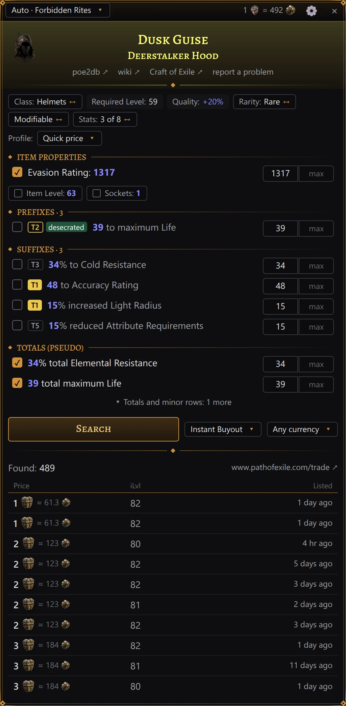
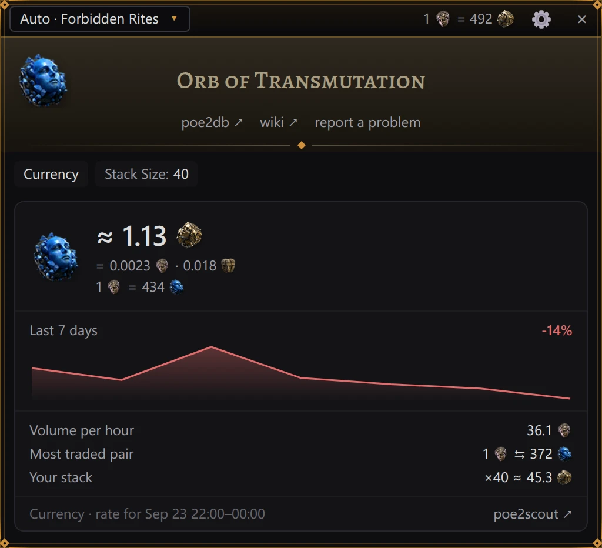

# Price check

This page names the panel's parts as the English interface shows them; the
[interface language](settings.md#interface-language) switches them to Russian. The item's own
text — its name, modifiers and properties — keeps the language the game copied it in.

## Checking an item

1. In the game, point at an item: in your inventory, in the stash or in a vendor's window.
2. Press <kbd>Ctrl</kbd>+<kbd>E</kbd>. This is the default; you can pick another key in the
   [settings](settings.md#hotkey).

PoE2 Oracle presses the game's own item-copy shortcut, <kbd>Ctrl</kbd>+<kbd>Alt</kbd>+<kbd>C</kbd>,
reads the item text from the clipboard and puts back whatever you had copied before. A panel then
opens over the full height of the game window: next to the inventory if the cursor was on the right
half of the game, next to the stash if it was on the left half. By itself it never covers the
inventory or the stash, but you can drag it over them (see below).

> [!NOTE]
> <kbd>Alt</kbd> in that shortcut is the game's key for advanced item descriptions. If you bound
> that action to another modifier key in the game's options, PoE2 Oracle reads your binding from the
> game's settings file and presses <kbd>Ctrl</kbd> + that key + <kbd>C</kbd> instead.

- The hotkey works only while the game or the panel is the window in front and the settings window
  is closed. In every other program <kbd>Ctrl</kbd>+<kbd>E</kbd> keeps its usual meaning.
- Press the hotkey over another item to check that one; the panel starts over for each item, but
  keeps the price currency you chose (see [Search options](#search-options)).
- With no item under the cursor, nothing happens.
- Close the panel with <kbd>Esc</kbd> or the **×** in its top-right corner. It does not close when
  the mouse leaves the item, so you can move into it and work with it. While the panel is open,
  <kbd>Esc</kbd> closes the panel and does not reach the game.
- Clicks on chips, checkboxes and buttons leave the keyboard with the game. Only the min/max boxes
  take the keyboard when you click into them; when the panel closes, the game gets it back.
- While the panel is open, the mouse over it (clicks and the wheel) works on the panel, not on the
  game.

The panel's top bar starts with the league being searched: **Auto · *league*** while the trade
site picks it, or the league you chose. Click it for the same choice of leagues the
[settings](settings.md#league) offer: your pick is saved there and the search runs again in the
new league. Leagues are named as the trade site in the interface language names them, the
English site's names in English. Once the exchange prices have loaded, the bar also shows how many
Exalted Orbs a Divine Orb is worth, drawn with the two currency icons. Drag the bar's empty part to
move the panel sideways: the next checks on that side open it there too, as far from the inventory
or the stash as you left it, whatever the [interface scale](settings.md#interface-scale). Dragged
back near the inventory or the stash, the panel sticks to it. A double-click on the bar puts the
panel back in its usual place. The gear **⚙** opens the [settings](settings.md); **×** closes the
panel.

> [!TIP]
> Numbers follow the interface language: `1.72` and `15%` in English, `1,72` and `15 %` in
> Russian. Large numbers are shortened with `k` and `M`: `4.1k` is 4,100. Every price is a number
> followed by the currency's icon, such as the Divine Orb's or the Exalted Orb's; a currency
> without an icon is named instead.

## The nameplate

At the top of the panel:

- the item's picture, when the item is in the app's item table;
- the name in the game's rarity colour, and the base type under it for rare and unique items;
- links **poe2db ↗** (the item's page on poe2db.tw, in Russian for items from a Russian client) and
  **wiki ↗** (the English Path of Exile 2 wiki, poe2wiki.net), for items in the app's item table.
  They open in your browser;
- the link **Craft of Exile ↗**, for an item the site can craft (gear, jewels, flasks, charms and
  waystones, not uniques or unidentified items): it opens the item in Craft of Exile's crafting
  simulator with its base, item level, rarity and modifiers, the site in the interface language;
- the link **report a problem**, for when the item was read or priced wrong. It opens PoE2 Oracle's
  own report window, not a browser, with **Item** selected and the item's text attached (and, by
  default, diagnostics). You describe what is wrong and click **Send**; no GitHub account is
  needed. See [Reporting a problem](report.md).

## The chip row

Under the nameplate, a row of chips describes the item and how it is searched.

Chips that only show information:

| Chip | Meaning |
|---|---|
| *item class*, without a label | Item class, as the game names it (in Russian for items from a Russian client), on an item whose search can't switch to its base: a unique, a gem, a Currency Exchange item and the like |
| **Item Level: …** | Item level |
| **Required Level: …** | Required character level |
| **Sockets: …** | Sockets |
| **Quality: +…%** | Quality |
| **Corrupted** | The item is corrupted |
| **Stack Size: …** | Stack size |

Chips with a gold **↔** at the end switch something when clicked; their outline turns gold under
the pointer. Hover any of them for an explanation.

| Chip | What it switches |
|---|---|
| **Class: …** ↔ **Base: …** | Search among every item of the class (a rare is compared with its whole class by default) or only among items of this base type. The base can matter on its own: a base implicit, a sought-after base. |
| **Rarity: …** | **Magic**, **Rare** or **Normal** searches only items of the same rarity; **Any Non-Unique** searches every rarity except unique. The chip starts on the item's own rarity, so a magic item is compared with magic items and a rare with rare items; a click switches it to **Any Non-Unique**, and another click back. |
| **Modifiable** ↔ **Corrupted or not** | For an item that is not corrupted, corrupted listings are left out by default: they cannot be changed and may have modifiers this item lacks. Click to include them. |
| **Corrupted only** ↔ **Corrupted or not** | For a corrupted item, only corrupted listings count by default, since corruption changed them the same way. Click to include uncorrupted ones. |
| **Unidentified only** ↔ **Identified too** | For an unidentified item, only unidentified listings count by default: identified ones sell for their modifiers. Click to include identified ones. |
| **Stats: N of M** | How many of the listed searchable rows are selected. Click to select all of them, or none. |

A unique item has no rarity chip: its name already pins the search down. Mirrored and sanctified
listings are left out of the search for ordinary gear unless your item is one; there is no chip
for that.

## Filters

Below the chips, the item's properties and modifiers are listed in sections:

| Section | Contents |
|---|---|
| **Item properties** | Item level, sockets, quality, defences, weapon DPS, attack speed, critical hit chance, waystone tier and the like |
| **Implicit modifiers** | Implicit modifiers |
| **Prefixes · N** | Prefix modifiers |
| **Suffixes · N** | Suffix modifiers |
| **Other modifiers**, or **Modifiers** on an item without prefixes and suffixes | Enchantments, rune and crafted modifiers and other lines that are not prefixes or suffixes |
| **Totals (pseudo)** | Sums across modifiers: total life, total elemental resistance, all attributes and so on; some are labelled **sum** |

The rows read the way the item does: an item from a Russian client lists its properties in the
game's Russian words (DPS as «УВС») and its modifiers as the client copied them, and the totals
are named by the Russian trade site.

Each row has a checkbox (whether the row takes part in the search), the modifier text with your
roll highlighted in blue, a tier badge and **min**/**max** boxes; a ticked modifier whose tier the
app knows also has a roll slider under it (see [Min and max](#min-and-max)). The tier badge is
gold-filled for T1, gold-outlined for T2 and grey for lower tiers. Small labels before the modifier
text, after the tier badge if there is one, say where a modifier comes from: **augment** (from a
rune or other augment), **crafted**, **fractured**, **enchant** (enchantment), **desecrated**. The
label **sum** in the same place, explained when you hover it, marks a total whose value adds up the
stat from all the item's modifiers: the trade site searches listings by the same sum. Rows labelled
**sum** appear only while PoE2 Oracle is signed in to pathofexile.com (section **Account** of the
[settings](settings.md#account)): the trade site adds stats up only for a signed-in account. Signed
out, the modifiers a sum would add up are rows of their own. A line the trade site cannot search
says **not part of the search**.

An item property left out of the search, such as item level, sockets or quality, is not a row but
a small chip with an empty checkbox under its section's rows. Click it to add it to the search: its
row appears, with bounds from the item's value. Untick the row and it folds back into a chip.

On a magic or rare item that can still take modifiers, rows **Empty prefix** / **Empty prefixes: N**
and **Empty suffix** / **Empty suffixes: N** (open prefix/suffix slots) can be searched too.

Some rows are folded away: unselected totals, and minor properties such as a weapon's physical or
elemental DPS when it is only a small part of the total. **▾ Totals and minor rows: N more** unfolds
them; **▴ Hide totals and minor rows (N)** folds them again.

### Search profiles

A search profile decides which rows are selected and where their bounds start. The row above the
filters starts with **Profile:** and a select naming the current profile. Click it for a menu of
the four profiles, each with a note on what it searches:

| Profile | Note in the menu |
|---|---|
| **Quick price** | up to 4 most valuable stats, your rolls as minimums |
| **Exact match** | all stats, your rolls as minimums |
| **Broad −10%** | checked stats, minimums 10% lower |
| **Crafting base** | implicit and fractured stats on the same base |

Picking a profile, the current one included, sets the rows up and searches once. A click outside
the menu or <kbd>Esc</kbd> closes it without searching. The select is there only for items searched
by their filter rows, not for Currency Exchange items or items searched by their exact name.

An item opens with **Exact match** if it is a unique, a relic, a flask or a charm, or if it can no
longer be modified (corrupted, mirrored, sanctified or unmodifiable) and is not a waystone. Every
other item opens with **Quick price**, and so does a crafting base that can still be modified: an
item of normal rarity, a fractured item, or one with quality above 20% or more rune sockets than
its base has.

What each profile selects:

- **Quick price** selects rows the way PoE Overlay II does. Every modifier gets a score from its
  tier (against the best tier the item's level allows), its tags weighted by the item class, how
  high it rolled within its range, and a few fixed bonuses. Up to 4 rows scoring 3 or more are
  selected, highest scores first, and no more than 2 of them may be **sum** rows. A local modifier
  (defences, weapon damage) counts toward the property it changes, and that property's row is
  selected instead. Magic items follow the same rule.
- **Exact match** selects every row outside **Item properties** that is not folded away, plus the
  item properties **Quick price** would pick.
- **Broad −10%** keeps the rows that are ticked now and sets each **min** 10% below the item's
  roll.
- **Crafting base** selects the implicit, fractured and granted-skill rows and item level, and
  searches among items of the same base type: the class chip switches to **Base: …**. The other
  profiles set that chip back to its default for the item.

In every profile a few stats are always selected: base implicits that define the base, such as
extra projectiles or bolts, chaining, piercing, maximum elemental resistances, spirit or movement
speed; unrevealed modifiers; a timeless jewel's legend; and granted skills of level 19 or higher
(of any level on an amulet).

In **Quick price** and **Exact match**, item level, sockets, quality, gem and waystone rows keep
their usual checkbox. A waystone starts on **Quick price**, which leaves all its modifiers
unselected: its tier and properties set the price, its modifiers only make the map harder. Select
a modifier yourself to search for it, or pick **Exact match** to search them all.

### Min and max

- Only **min** is filled in: your roll in **Quick price**, **Exact match** and **Crafting base**,
  10% below it in **Broad −10%**. **max** stays empty, since a higher roll is never a reason to
  leave a listing out.
- For the few modifiers where a lower number is better, **max** is filled in instead.
- A waystone's tier and numbers that name something instead of measuring it, such as a timeless
  jewel's legend, are searched exactly: **min** and **max** are both that number.
- **Broad −10%** doesn't lower item level, sockets, quality, a gem's level and sockets, a granted
  skill's level, a waystone's properties or a modifier that can roll only one value: they keep the
  same bound as in the other profiles.
- Type digits, a point or a comma (both give a decimal point) and a minus sign. The first key after
  you click into a box replaces its value.
- <kbd>Enter</kbd> in a box runs the search again with the new bounds.

Under a ticked modifier row whose tier the app's tier table knows, a slider runs from the lowest to
the highest roll of that modifier across all its tiers on this kind of item. A bright gold tick
marks your roll, and a gold circle, the handle, marks the search's **min** (its **max** on rows
where a lower number is better); the part of the track the search admits is lit gold. Click or drag
on the slider to move the handle, and the **min** (or **max**) box follows; typing in the box moves
the handle. Hover the slider for a short explanation that names the lowest and highest rolls.

Hover a tier badge to see where the tier stands: **Tier 3 of 9** (the tier among all tiers of that
modifier on this kind of item), the lowest roll of this tier, the lowest and highest rolls across
all tiers (**All tiers: …**), the item level the tier requires, and the best tier the item's level
can roll.

The button **Tier minimum**, on the right of the profile's row, shows while a ticked modifier row
has a known tier. It sets the **min** of every such ticked row to the bottom of its current tier,
so the search finds the same tier and better. Rows where a lower number is better are left alone.

Ticking or unticking rows, moving a slider, **Tier minimum** and switching the class, rarity,
corruption or identification chips take effect with the next search: press <kbd>Enter</kbd> in a
box or click **Search**.

## Search options

Under the filters, the **Search** button runs the search again; while a search runs, it reads
**Searching…**. Beside it (under it, on a narrow panel) are two more choices, each showing only its
current value. Each click on them moves to the next value and searches again at once.

- Sellers (the tooltip starts with "Sellers:"): **Buyout or In Person** → **Instant Buyout** (the
  default: the game's own auction sells the item without the seller online) → **In Person**
  (sellers online, to trade with them in the game) → **Any** (offline sellers too). The starting
  value comes from the [settings](settings.md#search), and every new item starts from it again.
- Price currency (the tooltip starts with "Price:"): **Any currency** → the Exalted Orb **or** the
  Divine Orb (shown by their icons) → **Only** the Exalted Orb → only the Divine Orb → only the
  Chaos Orb. This choice stays from item to item until you change it; each start of PoE2 Oracle
  resets it to **Any currency**.

## Results

- **Found: N** is the number of listings on the trade site. The link next to it,
  **www.pathofexile.com/trade ↗** (**ru.pathofexile.com/trade ↗** for an item from a Russian
  client), opens the same search in your browser.
- The table shows the 10 cheapest listings, cheapest first. Several listings of one seller at the
  same price share a row.
- Columns: **Price**, **iLvl** (item level), **Seller** (can be hidden in the settings) and
  **Listed**: "just now", "5 min ago", "3 hr ago", "2 days ago", "1 mo ago".
- A price is the amount and the currency's icon. Markers after it: **?** means the price comes
  from the stash tab's name, not from a note on the item, and may not be meant; **× N** means the
  seller listed N of these at that price. A price in a currency other than the Divine or the
  Exalted Orb also shows roughly what it is worth in one of those two.
- An envelope **✉** before the seller's name means the seller trades in person. A coloured dot
  shows their status: pink online, orange away, red offline. Listings without the envelope are
  instant buyout: buy those through the trade site.

### Copying the whisper

Click a row with **✉** to copy the trade site's whisper message for that listing. For a few
seconds the row reads **✓ copied — paste it into the chat**. Open the chat in the game, paste with
<kbd>Ctrl</kbd>+<kbd>V</kbd> and send it yourself. PoE2 Oracle never sends it for you.

### Listing details

Hover a row to see the listing the way the game's own item tooltip shows it: the name in its
rarity colour, properties, requirements, sockets with their runes, item level, every modifier,
flags such as **Corrupted** and the seller's note. Each modifier has its tier on the left and
**lvl N** (the item level it needs) on the right; as in the game's advanced (<kbd>Alt</kbd>)
tooltip, the prefixes (**P1**, **P2**…) come first, then the suffixes (**S1**…). The range a value
rolls in follows it in brackets, for example `+38(36-40)%`. The listing's own text is in the trade
site's language: in Russian for an item from a Russian client.

The modifiers you search for are marked:

- green **✓** — the modifier meets your bounds;
- red **✗** with **(needs …)** — it is outside them, and the bounds are shown;
- **Missing from this item:** at the foot of the card — selected rows the listing does not have at
  all.

### When nothing matches exactly

When a search finds nothing, the panel says **Nothing found** and offers two broader searches. Each
costs one search on the trade site, and only when you press it:

- **Broad −10%**: the same ticked rows, each **min** 10% below the item's roll. Not offered when
  that is already the profile.
- **Match N of M**: listings that have at least N of the M ticked rows, that is, all of them but
  one. Item properties such as defences, and **sum** rows, are not counted and always stay
  required. Offered only when at least two ticked rows count.

After **Match N of M**, the results say "No exact matches — showing items with at least N of M
selected stats", and each row shows how many of the selected rows it has, for example `3/4`, when
every ticked row that counts is a modifier, not a total or an empty slot. If that search finds
nothing either, the panel says "Nothing found — not even with N of M selected stats".

You can also widen the search yourself: untick some rows, lower some **min** values, search by
class instead of base, or let other sellers in with the sellers choice beside **Search**.

## Currency and exchange items

Items traded on the in-game Currency Exchange (currency, omens, runes, essences, catalysts, soul
cores, fragments, uncut and lineage gems, plain waystones and the like) are priced from GGG's own
record of the trades made on the exchange instead of trade listings. GGG publishes it hour by
hour, a few minutes after each hour ends: the price is the average rate of the last complete hour's
trades, or of up to three hours for an item traded rarely. The hours downloaded are kept, so
without an internet connection the card shows the last ones saved. The market card shows:

- **≈ price** with the icon of a Divine Orb or an Exalted Orb, and under it the same value in the
  other core currencies, each with its icon;
- for cheap items, how many of them one Divine Orb buys;
- **Last 7 days**: the price change in percent over the last seven days on poe2scout, with a chart
  of daily prices; days without a price are gaps. "not enough data" means what it says;
- **Volume per hour**, in Divine Orbs;
- **Most traded pair**: the rate of the pair this item is traded in most;
- **Your stack**: "×N ≈ …", what the whole stack you checked is worth;
- the item's group on the exchange and "rate for 09:00–10:00": the hours the price comes from, on
  your computer's clock, with the date when they are not today's; and a **poe2scout ↗** link to
  the item's page on poe2scout.

### When the exchange has no recent trades

Not every exchange item changes hands every hour: in a small league such as Standard many don't.
For an item without trades in the last hours:

- if poe2scout has a price, the panel says "Nobody traded this item on the Currency Exchange in
  *league* in the last hours.", shows **poe2scout price:** and offers the button **Trade site
  listings**. The trade site is searched only when you click it, since every search counts against
  its request limit;
- without a poe2scout price, the trade site's listings are searched right away, under the same
  note.

If GGG's exchange data cannot be reached and none is saved, the panel says "GGG's Currency
Exchange data is unavailable right now." and prices the item from poe2scout the same way; if
poe2scout cannot be reached either, it shows the trade site's listings. "No listings on the trade
site" means the trade site has no listings of the item.

### In a private league

A private league trades too little on the Currency Exchange to price anything by: even a busy one
makes a few dozen trades in half a day, and poe2scout does not list private leagues. So the market
card, the Divine Orb rate in the title bar and the **poe2scout price** of uniques come from the
public league yours is made from, the one its page on pathofexile.com names. Until the app has
read that page (signed out, say), it takes the current league, or its hardcore twin for a league
with "HC" or "Hardcore" in its name (**Forbidden Rites** and **HC Forbidden Rites** this season).
The card says so in a line under the price, "Prices from *league*: a private league trades too
little on the exchange.", and so does the rate's tooltip. Take them as a guide: a small league's
own rates can be far from the public league's. Trade site searches, listings included, stay in
your league.

## Unique items

An identified unique is searched by its name. Above the results, **poe2scout price:** shows its
price on poe2scout, with the currency's icon; in a private league, the public league's price, which
the line names ([In a private league](#in-a-private-league)).

An unidentified unique is compared with unidentified uniques of the same base. It has no poe2scout
line, since its name is not known yet.

## Waystones

A waystone's modifiers start unselected: its tier and properties decide the price. You can mark
modifiers to spot them at a glance on every waystone you check:

- click the **◇** at the end of a modifier row. Each click moves the mark on: danger (red) →
  caution (orange) → wanted (green) → no mark. A marked row shows **◆** in the mark's colour; to
  clear the mark, click it until it is **◇** again;
- marked modifiers are listed under the filters: **Danger:**, **Caution:**, **Wanted:**;
- while none of this waystone's modifiers is marked, the panel reminds you: "◇ at the end of a
  modifier marks it: danger, caution or wanted".

Marks are saved in PoE2 Oracle's [settings file](settings.md#where-the-settings-are-kept), not
shown in the settings window, and apply to the same modifier on every waystone, in both client
languages. Marking a modifier does not add it to the search.

## Vendor gambles

A vendor's gamble offer ("Random Helmet" and the like) is not searched. The panel says "This is a
vendor's gamble: which item it is shows only once you buy it. Items like this aren't sold on the
trade site."

## Messages

| Message | Meaning |
|---|---|
| "Loading trade site data…" | Loading the trade site's data. Happens on the very first start and takes a few seconds. |
| "No data from the trade site — no internet connection, or the site is down. Retrying automatically." | The trade site's data could not be downloaded: no internet, or the site is down. The app retries by itself. |
| "Hover over an item and press Ctrl+E" | Point at an item and press the hotkey. |
| "Searching…" | Searching. |
| "Loading exchange prices…" | Loading the Currency Exchange's prices for an exchange item. |
| "Trade API request limit — waiting Ns…" | The trade site's request limit is close; the app waits N seconds and then searches. |
| "The trade site has limited searches for a while — try again in 9m 50s." | Searches are on hold: the trade site has locked searches from your IP address for a while, or its limit would need a wait longer than 15 seconds. Search again after that time; Currency Exchange prices keep working. See [Request limits](#request-limits). |
| "Can't reach the trade site — check your internet connection and try again." | The trade site could not be reached. Check your connection and search again. |
| "The trade API refused the request (HTTP …): …" | The trade site refused the search; its own message follows. |
| "The trade site searches the “sum” rows only for a signed-in account, and it isn't accepting this app's sign-in now…" | The search had a ticked **sum** row, and the trade site did not accept PoE2 Oracle's sign-in. **Search without sums** builds the rows again without sums, as a signed-out search does, and searches once; **Sign in** opens the pathofexile.com sign-in page. |
| "The trade site finds this search too complex: uncheck some rows and search again. Signed in, the site allows more." | The search has more rows than the trade site takes. Untick some rows and search again, or sign in to pathofexile.com in the [settings](settings.md#account). |
| "Search failed: …" | Any other search error. |
| "Nothing found" | No listings match. Buttons under it offer broader searches, one trade search each: **Broad −10%** and **Match N of M**. "Nothing found — not even with N of M selected stats" means that **Match N of M** found nothing either. See [When nothing matches exactly](#when-nothing-matches-exactly). |
| "Nobody traded this item on the Currency Exchange in … in the last hours." | This exchange item has not been traded in your league in the last hours; poe2scout's price or the trade site's listings are shown instead. See [When the exchange has no recent trades](#when-the-exchange-has-no-recent-trades). |
| "GGG's Currency Exchange data is unavailable right now." | GGG's exchange data could not be reached; poe2scout's price or the trade site's listings are shown instead. |
| "No listings on the trade site" | The trade site has no listings of this exchange item. |
| "The game doesn't copy the item: another program takes Ctrl+Alt+C…" | Another program holds the copy shortcut, so the game never copied the item. See [Troubleshooting](troubleshooting.md#the-hotkey-does-nothing). |
| "Couldn't read the item…" | The item text could not be read. The button **Report a problem** under the message opens PoE2 Oracle's report window with **Item** selected and the item's text attached: describe what went wrong and click **Send**. See [Reporting a problem](report.md) and [Troubleshooting](troubleshooting.md#an-item-is-not-recognised). |

### Request limits

The trade site limits how many requests one IP address may make in a given time, and it counts
every request from it: PoE2 Oracle's, the trade site open in your browser and any other trade tool
on the same connection. A price check costs one search and one request for the 10 cheapest
listings. PoE2 Oracle reads the limits from the site's answers:

- when the next search would break a limit and the wait is 15 seconds or less, the app waits,
  saying "Trade API request limit — waiting Ns…", and then searches by itself. It does not sit out
  a longer wait: the search stops with "The trade site has limited searches for a while — try again
  in …" and the time left;
- when the trade site refuses a request, it locks your IP address out for a while, often for
  minutes. PoE2 Oracle then sends no trade request at all until the lockout ends and says when to
  try again: "The trade site has limited searches for a while — try again in 9m 50s." Currency
  Exchange prices keep working meanwhile.

Repeating an identical search within two minutes does not send a new request.
