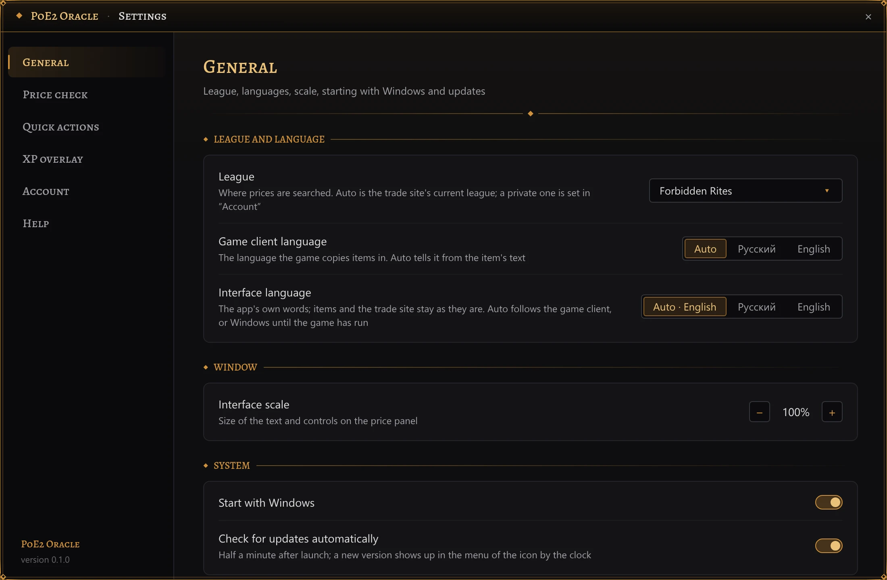

# Settings

Open the settings in any of these ways:

- a click on the tray icon, or its menu (right click) → **Settings**;
- a click on the **PoE2 Oracle** button on the taskbar, if you [show one](#system), or picking it in
  <kbd>Alt</kbd>+<kbd>Tab</kbd> or Task View;
- the gear **⚙** on the price panel;
- the gear **⚙** at the end of the [XP overlay](xp-overlay.md)'s plate above the flask panel;
- a click on the plate that says an update went in ([Updates](updates.md)), anywhere but its **×**;
- start PoE2 Oracle again while it is already running: the running copy opens its settings.

If the settings window is already open, any of these brings it to the front.

The window opens in the middle of the monitor the game is on and stays on top of the game. Drag it
by its title bar; resize it by its edges. The sections are listed on the left, the chosen section's
settings on the right.

Every change applies and is saved at once: there is no Save or Cancel button. Text in a box applies
when you press <kbd>Enter</kbd> or <kbd>Tab</kbd>, click elsewhere or close the window;
<kbd>Esc</kbd> in a box puts the old text back. The **×** in the title bar or <kbd>Esc</kbd> closes
the window; with the league list open, <kbd>Esc</kbd> closes that first.

While the settings window is open, the price panel is hidden and the price-check hotkey is off, so
that you can record a new one.

A gold-framed box at the top of **General** shows warnings marked **⚠** about your setup, such as
the game running as administrator, exclusive Fullscreen or the copy shortcut held by another
program. See [Troubleshooting](troubleshooting.md).

This page names the settings as the English interface shows them; the
[interface language](#interface-language) switches them to Russian.

## General

Section **General**: groups **League and language** (the league and both languages), **Window**
(the interface scale), **System** and **Updates**.

### League

Row **League**: a list of where prices are searched.

- **Auto · *league*** (the default): the trade site's current league, the first one it lists.
- Any league the trade site lists, named the way the site names it in the interface language
  (www.pathofexile.com's names in English, ru.pathofexile.com's in Russian), as on the price panel's
  league chip.
- **Private league · *name***: each of your account's PoE 2 private leagues, as pathofexile.com's
  **Private Leagues** page lists them, while you are signed in ([Account](#account)).
- The league you picked, when it is none of these: one the trade site no longer lists, under its
  trade site id (its English name), or a private league while you are signed out or it is no
  longer on your account (**Private league · *name***).

Notes under the row's name: "Loading the league list from the trade site" or "The league list from
the trade site didn't load"; "The trade site no longer lists this league — searches go to the
current one" means the league you picked has ended and searches go to the current league instead.
Signed out, the row adds that your private leagues show up here once you sign in. With a private
league picked, it names the public league its exchange and poe2scout prices come from (see
[In a private league](price-check.md#in-a-private-league)); signed out, it warns instead: "Without
a sign-in the site won't answer searches in a private league — sign in, in “Account”".

### Game client language

Row **Game client language**: **Auto** (the default), **Русский** (Russian) or **English**. On auto,
the language of each item is recognised from its copied text. The language decides how the item text
is read and which trade site is searched: ru.pathofexile.com for a Russian client,
www.pathofexile.com for an English one.

### Interface language

Row **Interface language**: **Auto · *language*** (the default), **Русский** (Russian) or
**English**, each language named in its own words. It is the language of PoE2 Oracle's own words:
the settings, the price panel, the overlays, the tray menu, the messages and the way numbers are
written (`15.1%` in English, `15,1 %` in Russian). What comes from the game and the trade site keeps
its language: item names and mod lines as the client copied them, league names as the trade site
gives them. A change applies at once, in every open window.

**Auto** follows the game client's language, which the game's own settings file names; before the
game has ever run, it follows the Windows display language. Its choice names the language it stands
for now, for example **Auto · English**.

The interface language also picks the pathofexile.com sign-in page (see [Account](#account)), the
language Craft of Exile opens in and the trade site whose league names the league lists show.

### Interface scale

Row **Interface scale**: 100% by default, from 80 to 150% in steps of 5, with the − and + buttons. It
sizes the text and controls of the price panel (its width too) and of the settings window, which
grows or shrinks around the pointer, so the − and + buttons stay under it. The price panel keeps its
place beside the inventory or the stash and grows away from it. The XP overlay is part of the game's
HUD and takes its size.

### System

Group **System**.

- **Where to show the app**: **In the tray** (the default), **On the taskbar** or **Both**, with
  the note "The icon by the clock or a button on the taskbar: a click on either opens these
  settings". **In the tray** keeps PoE2 Oracle's icon in the notification area next to the clock;
  **On the taskbar** keeps a **PoE2 Oracle** button on the taskbar for as long as the app runs;
  **Both** shows the two. While that button shows (**On the taskbar** or **Both**), the settings and
  report windows have no taskbar button of their own. A change applies at once. See
  [The tray icon and the taskbar button](install.md#the-tray-icon-and-the-taskbar-button).
- **Start with Windows**, off by default. It adds PoE2 Oracle to the apps Windows starts when you
  sign in; the installer's last page has the same option. Turning it on here also re-enables it if it
  was disabled in Task Manager's startup apps.

### Updates

Group **Updates**. See [Updates and uninstall](updates.md) for how updates work.

- **Update automatically**, on by default: stay connected to oracle.pushka.biz, and install new
  versions and new game data within minutes of their release, the app restarting once none of its
  windows is open. Off, the app doesn't connect to oracle.pushka.biz for updates; only a report you
  send goes there.
- The row under it names the app's version and its game data's ("Version *X.Y.Z* · game data
  *N*") and says what the updater is doing: "Connecting to oracle.pushka.biz…", "Connected to
  oracle.pushka.biz" with "You have the latest version", "No connection to oracle.pushka.biz — will
  connect when the internet is back", "Downloading version *X.Y.Z*…" or "Downloading new game
  data…", that a version or new game data is ready and goes in once the app's windows are closed,
  or "Couldn't update to version *X.Y.Z*: *why*. Will try again later" ("Couldn't update the game
  data: *why*. Will try again later"). Off, it reads "Off: the app doesn't connect to
  oracle.pushka.biz; new versions are on the website". **Check now**, shown while the switch is
  on, connects at once and retries a failed download right away.

## Price check

Section **Price check**: groups **Hotkey** and **Search**.

### Hotkey

Group **Hotkey**, row **Price check**. Click the key box and press the new combination: it takes
over from the old one as soon as you close the settings window. <kbd>Esc</kbd> or a second click on
the box keeps the old one.

A combination can be <kbd>Ctrl</kbd> or <kbd>Alt</kbd> (with or without <kbd>Shift</kbd>) plus a
letter A–Z or a digit 0–9, or one of <kbd>F1</kbd>–<kbd>F12</kbd>, alone or with modifiers. Letters
are physical keys: <kbd>Ctrl</kbd>+<kbd>E</kbd> stays the same key when the Russian keyboard layout
is on. The box refuses a combination and says why:

| Message | Reason |
|---|---|
| "Letters and digits need Ctrl or Alt — otherwise the key would stop typing" | Without Ctrl or Alt the letter or digit would stop typing everywhere |
| "Ctrl+C is taken: the app copies items with it" | Ctrl+C is how the item gets copied |
| "Alt+F4 closes windows, the game included" | Alt+F4 closes windows, the game included |
| "Combinations with the Windows key aren't supported" | Combinations with the Windows key are not supported |
| "Only letters A–Z, digits 0–9 and F1–F12 work" | Other keys can't be used |
| "Another quick action already uses this combination" | A quick action already uses it |

If another program already holds the combination, the box says so, for example "F7 is taken by
another program — Ctrl+E stays", and your previous hotkey keeps working. While the tray icon shows
(**In the tray** or **Both**), its tooltip names the hotkey in use.

### Search

Group **Search**.

- **Default sellers**: which sellers every new check searches. **Instant Buyout** (the default: you
  buy in the game and the seller need not be online), **Buyout or In Person** (instant buyout and
  sellers online), **In Person** (sellers online) or **Any** (everyone, offline too). The sellers
  choice beside **Search** on the price panel, which shows only its current value, such as
  **Instant Buyout**, still switches it for one item. Settings saved by an older version with its
  default, buyout or in person, move to Instant Buyout once; after that, your choice stays.
- **Seller column**, on by default: the seller's account name in the results table.

## Quick actions

Section **Quick actions**, group **Actions**: hotkeys that type chat commands or stash searches into
the game. Each action has its kind (**Chat** or **Stash**), its text, its key and a **×**; **+ Add
action** is below them. If another program holds a combination the actions press, such as
<kbd>Ctrl</kbd>+<kbd>F</kbd>, a gold-framed box at the top of the section says so. See
[Quick actions](quick-actions.md).

## XP overlay

Section **XP overlay**, group **XP line**. See [XP overlay](xp-overlay.md) for what it shows.

| Setting | Default | Meaning |
|---|---|---|
| **Show the XP overlay** | on | Show the experience rate and the time to the next level above the flask panel |
| **Level percentage** | off | Also show how much of the current level is done; a pause always shows it |
| **Map timer** | on | Show the time in the current map, the experience it gave and the session's average map time above the skill panel |
| **Rate smoothing** | 10m | 5, 10, 20 or 30 minutes. Shorter shows a change of farming sooner, longer reads steadier |

## Account

Section **Account**: group **pathofexile.com**, and **Private leagues** while you are signed in.
Signing in to pathofexile.com is needed to search private leagues, for the **sum** rows among the
[filters](price-check.md#filters) and for the trade site's buttons on listings, **To hideout** and
**Whisper** (see [The trade site's buttons](price-check.md#the-trade-sites-buttons)).

- **pathofexile.com.** The row tells what is known about your sign-in: "Sign in through the window
  that opened" while the sign-in window is open, "Not signed in", "Checking the sign-in…", "Signed
  in as *account*" (or "Signed in" when the site's page doesn't name the account), "Session
  expired" (the site no longer accepts it) or "Couldn't check the sign-in" (the check got no
  verdict: no connection, or an answer such as HTTP 503; the session is used as it is, and the line
  under it gives the reason). **Sign in** opens pathofexile.com's sign-in page in the app's own
  window, in the interface language (www.pathofexile.com in English, ru.pathofexile.com in
  Russian; both keep the same session): sign in as usual, through Steam too, and the window closes
  by itself. The session is kept in Windows' Credential Manager and sent to pathofexile.com only.
  **Sign out** makes PoE2 Oracle forget the session; you stay signed in on the site. The sign-in
  window needs the Microsoft Edge WebView2 Runtime: without it, a click on **Sign in** puts
  "Signing in needs the Microsoft Edge WebView2 Runtime, and this computer doesn't have it." under
  the row, with a link **Download from Microsoft**. If the window can't open, the row says
  "Couldn't open the sign-in window: *reason*"; if Windows doesn't keep the session, "Couldn't save
  the sign-in: *reason*". Such a line stays until the next **Sign in**.

- **Private leagues**, a card under the sign-in while you are signed in: your account's PoE 2
  private leagues, as pathofexile.com's **Private Leagues** page lists them. The league menus, in
  **General** and on the price panel, offer the same leagues: nothing needs typing. Exchange and
  poe2scout prices come from the public league yours is made from: see
  [In a private league](price-check.md#in-a-private-league).
  - **Your leagues** names each league and the public league it is made from ("HC FRites League
    by Cardiff (PL86503) based on HC Forbidden Rites"), with the note "They're in the league menus:
    in “General” and on the price panel", or says "None on this account yet. After joining one,
    press “Refresh”". **Refresh** looks them up again: meanwhile the button reads **Refreshing…**
    and the row "Looking them up on pathofexile.com…"; then the row says "Found *N* private
    leagues", shows that there are none, or says "Couldn't reach pathofexile.com: *reason*" and
    keeps the list it had. The league menus follow at once. Until the first list comes, the row
    also says that it's looking, or why it couldn't.
  - **Refresh automatically**, 1h by default: Off, 15m, 1h or 6h. While you are signed in, the
    leagues are looked up again that long after the last lookup, quietly: nothing opens or pops
    up, only the log notes it. A change applies at once. They are also looked up when the app
    starts with a saved sign-in, when you sign in, and each time the settings window opens.

## Help

Section **Help**, group **Help**.

- **Tutorial** → **Replay** runs the short guided tour again: the settings and the league, a price
  check, the price panel and the XP overlay, one at a time.
- **Report a problem or idea**, with the note "Straight to the developer from the app, no account
  needed. “Collect report” saves the logs, settings and unread item texts to your desktop in one
  archive, with your Windows user name hidden":
  - **Write to the developer** opens the [report window](report.md): write what went wrong or what
    you'd like, and PoE2 Oracle sends it to the developer. You need no account.
  - **Collect report** only saves the report: a zip with the logs, the settings and the item texts
    the app could not read, on your desktop, shown in File Explorer. Your Windows user name, if it
    has three characters or more, is hidden in it. Then the row says "Saved: *path*". See
    [Troubleshooting](troubleshooting.md#collecting-a-diagnostics-report).
- **Logs folder** → **Open** opens the folder with the logs of this run and the one before.
- **About**: PoE2 Oracle's version and license. **Licenses** opens `THIRD-PARTY-NOTICES.html`, which
  the installer puts next to the app: the licenses of everything it includes. **Website ↗** opens
  the app's site, [oracle.pushka.biz](https://oracle.pushka.biz/), in the interface language.
- **Quit the app** → **Quit** closes PoE2 Oracle, as **Quit** in the tray icon's menu and **Close
  window** on the taskbar button do. The note says "Price checks, quick actions and the XP overlay
  stop until you start it again from the Start menu".

## Where the settings are kept

`%APPDATA%\poe2-oracle\config\settings.json`, together with your waystone marks and quick actions.
If that file ever cannot be read, PoE2 Oracle renames it to `settings.json.bak` and starts from the
defaults.
