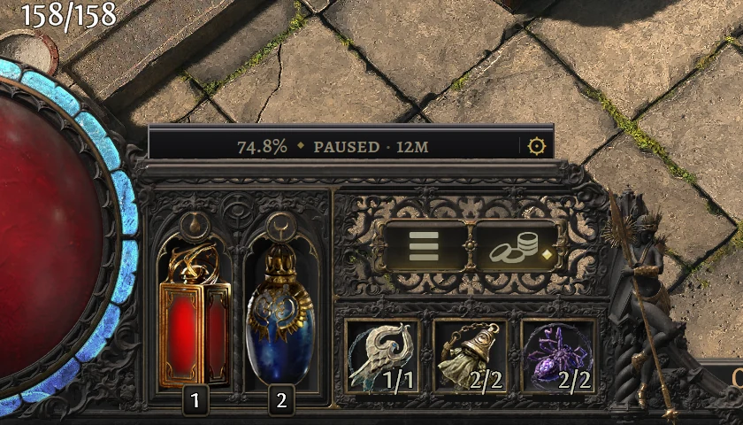

# XP overlay



PoE2 Oracle sets its experience readout on top of the game's own HUD. On the rail along the top
of the flask panel, left of the experience bar, stands a plate that tells how fast you gain
experience and when the next level comes, with a ⚙ at its end that opens the
[settings](settings.md). With the map timer on, a plate on the skill panel's rail shows the current
map. The plates stand on the rails, never over them -- the game fills the rails with its rage and
stun gauges -- and are built of the same molding. The overlay is on by default; the
[settings](settings.md#xp-overlay) section **XP overlay** turns it and its parts on and off.

Above the flask panel:

```text
64.8% ◆ +12.4%/h · level 75 in 2h 50m
```

Above the skill panel:

```text
map 4:07 +1.2% · avg 6:30
```

| Part | Meaning |
|---|---|
| `64.8%` | How much of the current level is done. Shown with **Level percentage**, off by default. |
| `+12.4%/h` | Experience per hour (`h`) of play, in percent of the current level. |
| `level 75 in 2h 50m` | Playing time to level 75 at this rate: 2 hours 50 minutes. `next level in` when your level is not known yet; `—` when there is no estimate. |
| `map 4:07 +1.2%` | Time in the current map and the experience it gave. Shown with **Map timer**, on by default. Dimmed once you leave the map; five minutes later it reads `last map`. |
| `avg 6:30` | Average time of the maps finished this session. |

Each line says as much as its plate has room for. When the whole wording doesn't fit, the flask
panel's line drops the level (`64.8% ◆ +12.4%/h · 2h 50m`) and then the percentage
(`+12.4%/h · 2h 50m`); the map line drops the average and `last`. For the first couple of minutes
the line reads `measuring rate…`. Times use `m` for minutes, `h` for hours and `d` for days. With
the Russian [interface language](settings.md#interface-language), the lines are in Russian:
`64,8 % ◆ +12,4 %/ч · до 75 ур. 2 ч 50 мин`.

In a town or hideout, and after five minutes of play without experience, the line dims and shows
a pause instead of the rate and the time to level, which would still be those of the play before:

```text
64.8% ◆ paused · 12m
```

`paused · 12m` is how long the pause has lasted. The map line keeps the map you left, dimmed and
without the average. The pause does not change the rate: it is back as it was when you play again.

## How it works

- Every two seconds PoE2 Oracle reads how full the experience bar is, straight from the screen, and
  reads the game's log (`Client.txt`) for level-ups, area changes and returns to character
  selection. Started in the middle of a session, it finds your character's level in the log.
- The rate weighs recent play more. With **Rate smoothing** at 10 minutes, the default, play from
  10 minutes ago counts half as much as play now. Choose 5 minutes to see a change of farming
  sooner, or 20 or 30 for a steadier number.
- Time in towns and hideouts does not count towards the rate. A level-up does not reset it, and
  neither does a death: the death costs experience, the rate stays.
- The map timer pauses, dimmed, when you leave the map, and continues when you go back into the
  same map through its portal, even once it reads `last map`. A map counts as finished when you
  enter a different map, whether or not you completed it. Returning to character selection starts
  the map statistics over.
- Ascendancy trials (the Trial of the Sekhemas and the Trial of Chaos) are never part of a map, but
  count as play for the rate.
- If something covers the bar for more than a few seconds (a loading screen, the passive tree, the
  price panel), that time counts only when you earned experience behind the cover, as in a fight
  with the price panel open, and the bar was back within a minute; otherwise neither that time nor
  the experience earned in it counts. After a few seconds without the bar the lines hide until it
  is back, except while the price panel is open: the HUD is still in view then.

## Requirements

- The game window must be at least 720 pixels tall and not minimised.
- The game must run in Windowed or Windowed Fullscreen mode, like everything PoE2 Oracle draws over
  it.
- The plates are the size of the game's HUD at the game's resolution; the **Interface scale**
  setting does not change them. They let clicks through to the game, all but the ⚙, and the price
  panel hides one only when you drag the panel over it.
