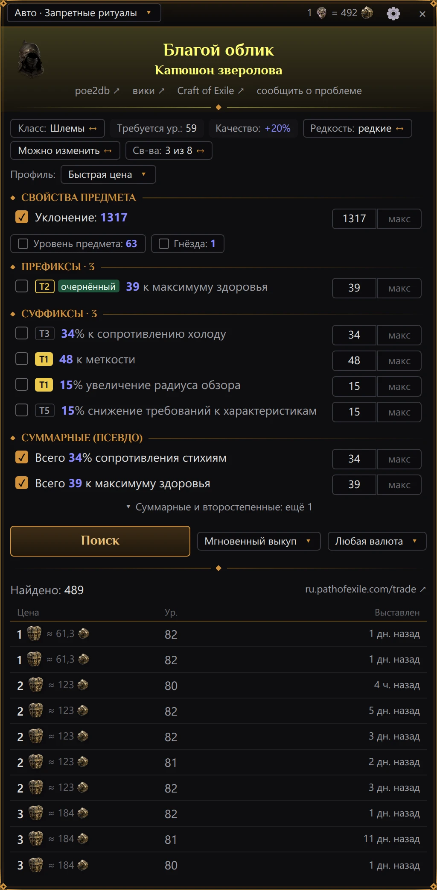
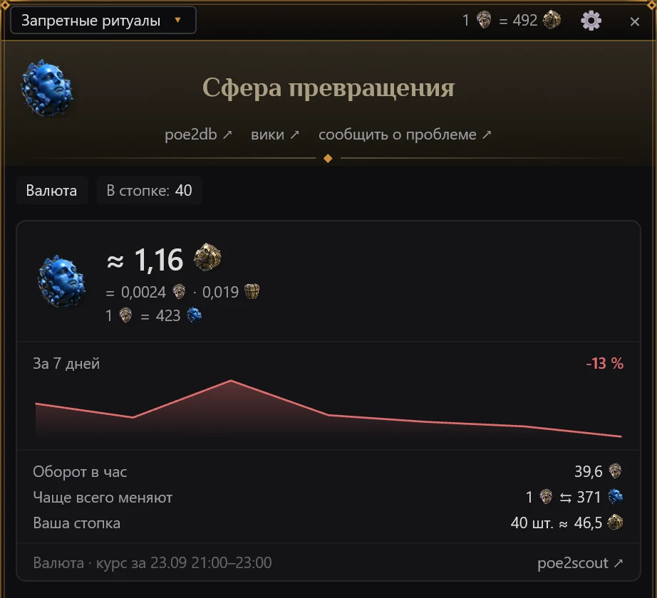

# Проверка цены

## Как проверить предмет

1. В игре наведите курсор на предмет — в инвентаре, в тайнике или в окне торговца.
2. Нажмите <kbd>Ctrl</kbd>+<kbd>E</kbd>. Это клавиша по умолчанию, её можно сменить в
   [настройках](settings.md#горячая-клавиша).

PoE2 Oracle нажимает за вас игровое сочетание копирования предмета
<kbd>Ctrl</kbd>+<kbd>Alt</kbd>+<kbd>C</kbd>, забирает текст предмета из буфера обмена и сразу
возвращает туда то, что было скопировано раньше. Затем на всю высоту окна игры открывается панель:
рядом с инвентарём, если курсор был в правой половине экрана игры, и рядом с тайником, если в
левой. Сама панель не закрывает инвентарь и тайник, но её можно перетащить поверх них (см. ниже).

> **Примечание.** <kbd>Alt</kbd> в этом сочетании — клавиша подробного описания предметов в игре.
> Если в настройках игры вы назначили для неё другую клавишу-модификатор, PoE2 Oracle прочитает это
> из файла настроек игры и нажмёт <kbd>Ctrl</kbd> + вашу клавишу + <kbd>C</kbd>.

- Горячая клавиша работает, только пока впереди окно игры или сама панель, а окно настроек
  закрыто. В остальных программах <kbd>Ctrl</kbd>+<kbd>E</kbd> делает то же, что и всегда.
- Чтобы проверить другой предмет, наведите курсор на него и нажмите клавишу ещё раз — панель
  начнёт заново, но сохранит выбранную валюту цены (см. [Параметры поиска](#параметры-поиска)).
- Если под курсором нет предмета, ничего не произойдёт.
- Закрыть панель — <kbd>Esc</kbd> или **×** в её правом верхнем углу. Когда курсор уходит с
  предмета, панель не закрывается: в неё можно перейти мышью и работать. Пока панель открыта,
  <kbd>Esc</kbd> закрывает её и до игры не доходит. Чтобы панель закрывалась и мышью, включите
  «Закрывать кликом вне панели» в [настройках](settings.md#панель): тогда щелчок в игре вне панели
  закрывает её, а сам щелчок всё равно доходит до игры. По умолчанию выключено.
- Щелчки по кнопкам, флажкам и плашкам панели оставляют клавиатуру игре. Клавиатуру забирают
  только поля «мин» и «макс», когда вы в них щёлкаете; после закрытия панели она возвращается игре.
- Пока панель открыта, мышь над ней — щелчки и колесо — работает с панелью, а не с игрой.

Верхняя строка панели начинается с лиги, в которой идёт поиск: **Авто · *лига***, пока её выбирает
сайт торговли, или лига, которую выбрали вы. Щелчок по ней открывает тот же список лиг, что и в
[настройках](settings.md): выбор сохраняется там же, и поиск повторяется в новой лиге. Названия
лиг — как их даёт сайт торговли на языке интерфейса. Когда загрузятся цены биржи, в строке
появляется и курс: сколько сфер возвышения стоит одна божественная сфера (со значками валют). За
пустую часть строки панель можно перетащить вбок: следующие проверки с этой стороны откроют её
там же — на том же расстоянии от инвентаря или тайника при любом
[масштабе интерфейса](settings.md#масштаб-интерфейса). Если подвести панель обратно к инвентарю или
тайнику, она прилипнет к нему. Двойной щелчок по строке возвращает панель на обычное место.
Шестерёнка **⚙** открывает [настройки](settings.md), **×** закрывает панель.

Все цены на панели записаны числом и значком валюты — божественной сферы, сферы возвышения и так
далее; валюта без значка названа словами.

## Табличка с названием

Вверху панели:

- картинка предмета, если он есть в таблице предметов программы;
- название цветом редкости, как в игре, а под ним у редких и уникальных — базовый предмет;
- ссылки «poe2db ↗» (страница предмета на poe2db.tw, для русского клиента — русская) и «вики ↗»
  (английская вики Path of Exile 2, poe2wiki.net) — для предметов из таблицы программы. Они
  открываются в браузере;
- ссылка «Craft of Exile ↗» — для предмета, который умеет собирать этот сайт (снаряжение,
  самоцветы, флаконы, обереги и путевые камни, кроме уникальных и неопознанных): открывает предмет в
  симуляторе крафта Craft of Exile с его базой, уровнем предмета, редкостью, собственными свойствами
  и модификаторами, сайт — на языке интерфейса. Это работает с любым из двух клиентов: собственный
  импорт Craft of Exile читает только текст английского клиента, поэтому ссылка передаёт предмет по
  внутренним id игры — базы и каждого модификатора с его значениями, — а они на любом языке одни и
  те же. Модификатор, в id которого программа не уверена, пропускается, а не угадывается;
- ссылка «сообщить о проблеме» — если предмет прочитан или оценён неверно. Она открывает не
  браузер, а окно сообщения разработчику: в нём уже выбран вид «Предмет» и приложен текст предмета
  (и по умолчанию диагностика). Остаётся описать, что не так, и нажать «Отправить»; аккаунт GitHub
  не нужен. См. [Сообщить о проблеме](report.md).

## Плашки

Под названием — ряд плашек: что это за предмет и как его ищут.

Плашки только для сведения:

| Плашка | Что значит |
|---|---|
| *класс предмета* (без подписи) | Класс предмета, как его называет игра, — у предмета, поиск которого нельзя переключить на базу: уникального, камня, биржевого предмета и т. п. |
| «Ур. предмета: …» | Уровень предмета |
| «Требуется ур.: …» | Требуемый уровень персонажа |
| «Гнёзда: …» | Гнёзда |
| «Качество: +…%» | Качество |
| «Осквернено» | Предмет осквернён |
| «В стопке: …» | Размер стопки |

Плашки с золотым значком **↔** в конце переключаются щелчком; под курсором их рамка загорается
золотом. Наведите на любую — появится подсказка.

| Плашка | Что переключает |
|---|---|
| «Класс: …» ↔ «База: …» | Искать среди всех предметов класса (редкий предмет по умолчанию сравнивается со всем классом) или только среди предметов той же базы. База бывает ценна сама по себе: собственное свойство базы, редкая база. |
| «Редкость: …» | «волшебные», «редкие» или «обычные» — искать только предметы той же редкости; «все, кроме уникальных» — любой редкости, кроме уникальной. Сначала на плашке редкость самого предмета: волшебный предмет сравнивается с волшебными, редкий — с редкими; щелчок переключает на «все, кроме уникальных», ещё один — обратно. |
| «Можно изменить» ↔ «И осквернённые, и нет» | Если ваш предмет не осквернён, осквернённые лоты по умолчанию не учитываются: их нельзя изменить, и у них бывают свойства, которых нет у вашей вещи. Щелчок включает их в поиск. |
| «Только осквернённые» ↔ «И осквернённые, и нет» | Если ваш предмет осквернён, по умолчанию учитываются только осквернённые лоты: осквернение изменило их так же. Щелчок добавляет неосквернённые. |
| «Неопознанные» ↔ «И опознанные» | Если ваш предмет не опознан, по умолчанию учитываются только неопознанные лоты: опознанные продаются за свои свойства. Щелчок добавляет опознанные. |
| «Св-ва: N из M» | Сколько свойств из найденных выбрано для поиска. Щелчок отмечает все или снимает все. |

У уникального предмета плашки редкости нет: его и так однозначно определяет название. Отражённые и
освящённые лоты для обычного снаряжения исключаются из поиска, если ваш предмет сам не такой;
отдельной плашки для этого нет.

## Фильтры

Под плашками — свойства предмета, по разделам:

| Раздел | Что в нём |
|---|---|
| «Свойства предмета» | Уровень предмета, гнёзда, качество, защита, урон в секунду оружия, скорость атаки, шанс критического удара, уровень путевого камня и т. п. |
| «Собственные свойства» | Собственные (неявные) свойства |
| «Префиксы · N» | Префиксы |
| «Суффиксы · N» | Суффиксы |
| «Прочие свойства» или «Свойства» | Зачарования, свойства от рун и мастера и другие строки, которые не префиксы и не суффиксы |
| «Суммарные (псевдо)» | Суммы по всем свойствам: всего здоровья, всего сопротивления стихиям, всех характеристик и т. д.; у части из них метка «сумма» |

В каждой строке — флажок (участвует ли строка в поиске), текст свойства с вашим значением синим,
значок тира и поля **мин** и **макс**; у отмеченного свойства, тир которого программа знает, под
текстом есть ещё ползунок (см. [Мин и макс](#мин-и-макс)). Значок T1 залит золотом, T2 обведён
золотом, тиры ниже — серые. Маленькие метки перед текстом свойства, после значка тира, если он
есть, говорят, откуда свойство: «усилитель» (от руны или другого усилителя), «мастер» (создано
ремеслом), «расколотый», «зачарование», «очернённый». Метка «сумма» там же (с пояснением при
наведении) отмечает суммарную строку, значение которой сложено из всех модификаторов вещи с этим
свойством: сайт торговли ищет лоты по такой же сумме. Строки «сумма» появляются, только если
выполнен вход на pathofexile.com (раздел «Аккаунт» в [настройках](settings.md#аккаунт)): без
входа сайт торговли такие суммы не ищет, и свойства, из которых они сложены, остаются отдельными
строками. Строка, которую сайт торговли искать не умеет, помечена «не участвует в поиске».

Свойство предмета, которое не участвует в поиске (уровень предмета, гнёзда, качество и т. п.),
показано не строкой, а плашкой с пустым флажком под строками своего раздела. Щелчок по плашке
добавляет свойство в поиск: появляется его строка с границами от значения предмета. Если снять
флажок, строка снова свернётся в плашку.

У волшебного или редкого предмета, которому ещё можно добавить свойства, есть строки «Свободный
префикс» / «Свободных префиксов: N» и «Свободный суффикс» / «Свободных суффиксов: N» — их тоже можно
искать.

Часть строк свёрнута: невыбранные суммарные и второстепенные свойства — например физический или
стихийный урон в секунду оружия, когда он лишь малая часть общего. «▾ Суммарные и второстепенные:
ещё N» разворачивает их, «▴ Свернуть суммарные и второстепенные (N)» сворачивает обратно.

### Профили поиска

Какие строки отмечены и какие у них начальные границы, решает профиль поиска. Ряд над фильтрами
начинается с «Профиль:» и плашки с названием текущего профиля. Щелчок по плашке открывает меню из
четырёх профилей, у каждого — пояснение, что он ищет:

| Профиль | Пояснение в меню |
|---|---|
| «Быстрая цена» | «до 4 самых ценных свойств, от ваших значений» |
| «Точное совпадение» | «все свойства, от ваших значений» |
| «Широкий −10 %» | «отмеченные свойства, минимумы на 10 % ниже» |
| «База для крафта» | «собственные и расколотые свойства на этой же базе» |

Выбор профиля, в том числе текущего, заново настраивает строки и один раз выполняет поиск. Щелчок
мимо меню или <kbd>Esc</kbd> закрывает его без поиска. Плашка профиля есть только у предметов,
которые ищутся по строкам фильтров, — у предметов валютной биржи и у предметов, которые ищутся по
точному названию, её нет.

С профилем «Точное совпадение» открываются уникальные предметы, реликвии, флаконы и обереги, а
также предметы, которые уже нельзя изменить (осквернённые, отражённые, освящённые или
неизменяемые), кроме путевых камней. Все остальные предметы открываются с профилем «Быстрая
цена», как и база для крафта, которую ещё можно изменить: предмет обычной редкости, расколотый
предмет, предмет с качеством выше 20% или с большим числом гнёзд для рун, чем у его базы.

Что отмечает каждый профиль:

- «Быстрая цена» выбирает строки так же, как PoE Overlay II. Каждое свойство получает очки: за
  тир (в сравнении с лучшим тиром, доступным на уровне предмета), за теги с весами по классу
  предмета, за то, насколько высоко значение выпало в своих пределах, и несколько постоянных
  надбавок. Отмечается не больше 4 строк, набравших от 3 очков, начиная с лучших, и среди них не
  больше 2 строк с меткой «сумма». Локальное свойство (защита, урон оружия) засчитывается
  характеристике, которую оно меняет, и отмечается строка этой характеристики. У волшебных
  предметов правило то же.
- «Точное совпадение» отмечает все несвёрнутые строки вне раздела «Свойства предмета» и те
  характеристики предмета, которые выбрала бы «Быстрая цена».
- «Широкий −10 %» оставляет отмеченными те строки, что отмечены сейчас, и ставит каждое **мин** на
  10% ниже значения предмета.
- «База для крафта» отмечает собственные и расколотые свойства, дарованные умения и уровень
  предмета и ищет среди предметов той же базы: плашка класса переключается на «База: …». Другие
  профили возвращают этой плашке значение по умолчанию для предмета.

В любом профиле всегда отмечены несколько характеристик: собственные свойства, которые определяют
базу, — например дополнительный снаряд или болт, дополнительный удар по цепи, пронзание, максимум
сопротивлений стихиям, дух или скорость передвижения; нераскрытые свойства; легенда вневременного
самоцвета; дарованные умения 19-го уровня и выше (на амулете — любого уровня).

В профилях «Быстрая цена» и «Точное совпадение» флажки у строк уровня предмета, гнёзд, качества,
камня умения и путевого камня ставятся как обычно. Путевой камень начинает с «Быстрой цены», и все
его свойства сначала не отмечены: цену задают его уровень и характеристики, а свойства лишь
усложняют карту. Нужное свойство отметьте сами или выберите «Точное совпадение», чтобы искать все.

### Мин и макс

- Заполнено только **мин**: ваше значение в профилях «Быстрая цена», «Точное совпадение» и «База
  для крафта», на 10% ниже него — в профиле «Широкий −10 %». **Макс** остаётся пустым: более
  высокое значение не повод отбрасывать лот.
- Для немногих свойств, где меньшее число лучше, наоборот, заполнено **макс**.
- Уровень путевого камня и числа, которые что-то называют, а не измеряют (например, легенда
  вневременного самоцвета), ищутся точно: и **мин**, и **макс** равны этому числу.
- Профиль «Широкий −10 %» не снижает уровень предмета, гнёзда, качество, уровень и гнёзда камня
  умения, уровень дарованного умения, характеристики путевого камня и свойство, у которого
  возможно лишь одно значение: их граница та же, что и в других профилях.
- Вводятся цифры, точка или запятая (обе дают десятичную точку) и минус. Первая клавиша после
  щелчка по полю заменяет его значение целиком.
- <kbd>Enter</kbd> в поле повторяет поиск с новыми границами.

Под отмеченной строкой свойства, тир которого известен таблице тиров программы, есть ползунок: от
самого низкого до самого высокого значения этого свойства во всех его тирах на предметах такого
вида. Светлая золотая риска — значение вашего предмета, а золотой кружок-бегунок — **мин** поиска
(**макс** там, где меньшее число лучше); часть шкалы, которую поиск допускает, подсвечена золотом.
Щелчок или перетаскивание по ползунку двигают бегунок, и поле **мин** (или **макс**) меняется
вслед за ним; число, введённое в поле, двигает бегунок. При наведении на ползунок появляется
короткое пояснение, где названы самое низкое и самое высокое значения.

Наведите курсор на значок тира — подсказка покажет, где стоит этот тир: «Тир 3 из 9» (какой это
тир среди всех тиров этого свойства на предметах такого вида), нижнюю границу этого тира, самое
низкое и самое высокое значение во всех тирах («Все тиры: …»), уровень предмета, нужный для этого
тира, и лучший тир, который может выпасть при уровне этого предмета.

Пока среди отмеченных строк есть свойство с известным тиром, справа в ряду профиля видна кнопка
«Минимум тира». Она ставит **мин** каждой такой отмеченной строки на нижнюю границу её нынешнего
тира: поиск найдёт вещи с тем же тиром и лучше. Строки, где меньшее число лучше, она не трогает.

Флажки, ползунок, кнопка «Минимум тира», а также плашки класса, редкости, осквернения и
опознания срабатывают со следующим поиском: нажмите <kbd>Enter</kbd> в поле или кнопку «Поиск».

## Параметры поиска

Под фильтрами кнопка «Поиск» запускает поиск заново; пока он идёт, на ней написано «Поиск…». Рядом с
ней (на узкой панели — под ней) ещё два выбора, на каждом видно только его текущее значение. Каждый
щелчок по ним переключает на следующее значение и сразу повторяет поиск.

- Продавцы (подсказка начинается с «Продавцы:») — «Выкуп и онлайн» → «Мгновенный выкуп» (по
  умолчанию: вещь продаёт сам аукцион игры, продавцу не нужно быть в сети) → «Онлайн» (продавцы в
  игре, договориться лично) → «Все» (и продавцы не в сети). Начальное значение задаётся в
  [настройках](settings.md#поиск), и каждый новый предмет начинает с него.
- Валюта цены (подсказка начинается с «Цена:») — «Любая валюта» → сфера возвышения «или»
  божественная сфера → «Только» сфера возвышения → только божественная → только сфера хаоса.
  Валюты показаны значками. Этот выбор сохраняется от предмета к предмету, пока вы его не смените;
  при каждом запуске PoE2 Oracle он снова «Любая валюта».

## Результаты

- «Найдено: N» — сколько лотов нашёл сайт торговли. Ссылка рядом, «www.pathofexile.com/trade ↗»
  или «ru.pathofexile.com/trade ↗», открывает этот же поиск в браузере.
- В таблице — 10 самых дешёвых лотов, от дешёвых к дорогим. Несколько лотов одного продавца по
  одной цене собраны в одну строку.
- Столбцы: «Цена», «Ур.» (уровень предмета), «Продавец» (можно скрыть в настройках) и «Выставлен»:
  «только что», «5 мин. назад», «3 ч. назад», «2 дн. назад», «1 мес. назад».
- Цена — это число и значок валюты. Пометки после неё: **?** — цена взята из названия вкладки
  тайника, а не из заметки к вещи, и может быть ненастоящей; **× N** — продавец выставил N таких по
  этой цене. Цена в другой валюте, не в божественных сферах и не в сферах возвышения, дополнена
  примерным пересчётом в одну из них.
- Конверт **✉** перед именем продавца — он продаёт лично, через личное сообщение. Цветная точка —
  его статус: розовая — в сети, оранжевая — отошёл, красная — не в сети. Лоты без конверта — с
  мгновенным выкупом: их покупают в убежище продавца, куда переносит кнопка «В убежище» (см.
  [Кнопки сайта торговли](#кнопки-сайта-торговли)).

### Скопировать сообщение продавцу

Щелчок по строке с **✉** копирует сообщение продавцу, которое для этого лота составил сайт
торговли. На несколько секунд строка сменится на «✓ скопировано — вставьте в чат». Откройте чат в
игре, вставьте сообщение (<kbd>Ctrl</kbd>+<kbd>V</kbd>) и отправьте сами: копирование ничего не
отправляет.

### Кнопки сайта торговли

Пока вы вошли на pathofexile.com (см. [Аккаунт](settings.md#аккаунт)), в конце ячейки продавца
у лота есть и кнопка самого сайта торговли:

- «В убежище» у лота с мгновенным выкупом — это «Перейти в убежище» сайта: сайт торговли переносит
  вашего персонажа в игре в убежище продавца, где вы покупаете предмет. Продавцу не нужно быть в
  сети.
- «Написать» у лота продавца в сети или отошедшего — это «Личное сообщение» сайта: сайт торговли
  отправляет продавцу сообщение этого лота от вашего персонажа.

Сайт делает это через вашу игровую сессию; PoE2 Oracle ничего не нажимает в игре. Одно нажатие —
один запрос к сайту, и само нажатие никогда не повторяется. Затем строка вместо продавца и времени
выставления пишет, чем кончилось:

- «✓ Телепортация в убежище продавца» или «✓ Сообщение отправлено» — сайт это сделал.
- «Уже востребован» с кнопкой «Всё равно» — сайт пишет, что предмет уже востребован. «Всё равно»
  всё-таки переносит в убежище продавца, как повторное подтверждение на самом сайте.
- «✗ Лота уже нет — повторите поиск» или «✗ Продавца уже нет — повторите поиск» — для этого лота
  сайт этого больше не сделает. Если сайт что-то ответил, его слова — в подсказке при наведении.
- «✗ Устарело — повторите поиск» — кнопки лота сайт принимает несколько минут после поиска, позже
  программа их не отправляет.
- «✗ Войдите снова: настройки, «Аккаунт»» — сайт больше не принимает вход программы.
- «Лимит запросов — через N с» — лимит сайта на эти кнопки. Кнопка остаётся: нажмите её снова,
  когда время выйдет.
- «✗ Сайт не ответил» — нет связи или сбой сайта. Кнопка остаётся.

Без входа кнопок нет — и у лотов, найденных до входа, тоже.

### Подробности лота

Наведите курсор на строку — появится карточка лота, как подсказка к предмету в игре: название в
цвете редкости, характеристики, требования, гнёзда с рунами, уровень предмета, все модификаторы,
пометки вроде «Осквернено» и примечание продавца. Слева от модификатора — его тир, справа —
«ур. N», уровень предмета, нужный для этого модификатора. Как в расширенной подсказке игры (с
<kbd>Alt</kbd>), сначала идут префиксы (**P1**, **P2**…), потом суффиксы (**S1**…). После значения
в скобках — пределы, в которых оно выпадает, например `+38(36-40)%`.

Модификаторы, которые вы ищете, отмечены:

- зелёная **✓** — свойство укладывается в ваши границы;
- красный **✗** с «(нужно …)» — не укладывается, в скобках границы;
- «Нет у этого предмета:» внизу карточки — выбранные свойства, которых у лота нет совсем.

### Когда точных совпадений нет

Если поиск ничего не нашёл, панель пишет «Ничего не найдено» и предлагает две кнопки, чтобы
поискать шире. Каждая стоит одного поиска на сайте торговли, и тратится он только по нажатию:

- «Широкий −10 %» — те же отмеченные строки, каждое **мин** на 10% ниже значения предмета. Этой
  кнопки нет, если такой профиль уже выбран.
- «Совпадение N из M» — лоты, у которых есть хотя бы N из M отмеченных строк, то есть все, кроме
  одной. Характеристики предмета вроде защиты и строки с меткой «сумма» не считаются и остаются
  обязательными. Кнопка есть, только если отмечено не меньше двух строк, которые считаются.

После поиска кнопкой «Совпадение N из M» над результатами будет «Точных совпадений нет — показаны
предметы хотя бы с N из M выбранных свойств», а в каждой строке — сколько выбранных свойств есть у
лота, например `3/4`, если все отмеченные строки, которые считаются, — модификаторы, а не суммарные
строки и не свободные слоты. Если не нашлось и так, панель напишет «Ничего не найдено — даже с N из
M выбранных свойств».

Расширить поиск можно и самому: снимите часть флажков, уменьшите какие-то **мин**, ищите по классу
вместо базы или смените продавцов выбором рядом с кнопкой «Поиск».

## Валюта и биржевые предметы

Предметы, которыми торгуют на игровой валютной бирже (валюта, предзнаменования, руны, сущности,
катализаторы, ядра душ, фрагменты, неогранённые и династические камни, обычные путевые камни и
т. п.), оцениваются не по лотам, а по сводкам сделок биржи, которые публикует сама GGG. Сводки
выходят по часам, через несколько минут после конца часа: цена — средний курс сделок последнего
полного часа, а для редко меняемых предметов — до трёх часов. Скачанные часы сохраняются, так что
без интернета карточка показывает последние сохранённые. В карточке рынка:

- **≈ цена** со значком божественной сферы или сферы возвышения, а под ней та же сумма в других
  основных валютах, каждая со своим значком;
- для дешёвых предметов — сколько штук дают за одну божественную сферу;
- «За 7 дней» — изменение цены в процентах за последние семь дней по poe2scout и график цены по
  дням; дни без цены — разрывы графика. «мало данных» — данных недостаточно;
- «Оборот в час» — в божественных сферах;
- «Чаще всего меняют» — курс пары, в которой этот предмет меняют чаще всего;
- «Ваша стопка» — «N шт. ≈ …», сколько стоит вся проверенная стопка;
- категория и «курс за 09:00–10:00» — часы, по которым посчитана цена, по часам вашего
  компьютера, с датой, если это не сегодня; и ссылка «poe2scout ↗» на страницу предмета на
  poe2scout.

### Когда на бирже нет свежих сделок

Не каждый биржевой предмет меняют каждый час: в небольшой лиге вроде Standard многие не меняют.
Для предмета без сделок за последние часы:

- если цена есть у poe2scout, панель пишет «На бирже в лиге … этот предмет за последние часы не
  меняли.», показывает «Цена по poe2scout:» и кнопку «Лоты на площадке». Сайт торговли ищет лоты,
  только когда вы её нажмёте: каждый поиск расходует его лимит запросов;
- если цены нет и у poe2scout, лоты на сайте торговли ищутся сразу, под той же пометкой.

Если данные биржи GGG недоступны и сохранённых нет, панель пишет «Данные биржи GGG сейчас
недоступны.» и так же показывает цену с poe2scout; если недоступен и poe2scout — лоты с сайта
торговли. «На площадке лотов нет» — на сайте торговли этот предмет никто не продаёт.

### В приватной лиге

На бирже приватная лига торгует слишком мало, чтобы по ней считать цены: даже в оживлённой за полдня
набирается несколько десятков сделок, а poe2scout приватных лиг не знает. Поэтому карточка рынка,
курс божественной сферы в заголовке и «Цена по poe2scout» у уникальных предметов берутся из
публичной лиги, на которой сделана ваша, — той, что названа на её странице на pathofexile.com.
Пока программа эту страницу не прочитала (например, без входа), берётся текущая лига или её
хардкорная пара, если в названии лиги есть «HC» или «Hardcore» (в этом сезоне — «Запретные
ритуалы» и «HC Forbidden Rites»). Об этом
говорят строка под ценой в карточке, «Цены из лиги *лига*: в приватной лиге слишком мало сделок на
бирже.», и подсказка у курса. Считайте их ориентиром: свои курсы у маленькой лиги могут сильно
отличаться от публичной. Поиск на сайте торговли, в том числе лоты, остаётся в вашей лиге.

## Уникальные предметы

Опознанный уникальный предмет ищется по названию. Над результатами строка «Цена по poe2scout:» —
его цена на poe2scout, со значком валюты; в приватной лиге — цена публичной лиги, которую строка
называет ([В приватной лиге](#в-приватной-лиге)).

Неопознанный уникальный предмет сравнивается с неопознанными уникальными той же базы. Строки
poe2scout у него нет: название ещё неизвестно.

## Путевые камни

Свойства путевого камня сначала не отмечены: цену задают его уровень и характеристики. Свойства
можно пометить, чтобы сразу замечать их на каждом проверенном камне:

- щёлкните **◇** в конце строки свойства. Каждый щелчок меняет пометку: опасно (красная) →
  осторожно (оранжевая) → желанно (зелёная) → без пометки. У помеченной строки вместо **◇** стоит
  **◆** цвета пометки; чтобы снять пометку, щёлкайте по нему, пока он снова не станет **◇**;
- помеченные свойства перечислены под фильтрами: «Опасно:», «Осторожно:», «Желанно:»;
- пока ни одно свойство этого камня не помечено, панель подсказывает: «◇ в конце свойства —
  пометить его: опасно, осторожно или желанно».

Пометки сохраняются в [файле настроек](settings.md#где-хранятся-настройки) программы — в окне
настроек их нет — и действуют на это же свойство на любом путевом камне, в клиенте на любом языке.
Пометка не добавляет свойство в поиск.

## Ставки у торговца

Ставку у торговца («Случайный шлем» и подобные) программа не ищет. Панель пишет «Это ставка у
торговца: какой предмет выпадет, станет известно только после покупки. На площадке такие не
продаются.»

## Сообщения

| Сообщение | Что значит |
|---|---|
| «Загрузка каталога…» | Загружаются данные сайта торговли. Бывает при самом первом запуске и занимает несколько секунд. |
| «Нет данных сайта торговли — нет интернета или сайт недоступен. Повторяю попытку сам.» | Не удалось скачать данные сайта торговли: нет интернета или сайт не работает. Программа сама пробует снова. |
| «Наведите курсор на предмет и нажмите Ctrl+E» | Подсказка: наведите курсор на предмет и нажмите горячую клавишу. |
| «Поиск…» | Идёт поиск. |
| «Загрузка цен биржи…» | Загружаются цены валютной биржи для биржевого предмета. |
| «Лимит запросов trade API — ждём N с…» | Близок лимит запросов сайта торговли: программа подождёт N секунд и выполнит поиск. |
| «Сайт торговли временно ограничил поиск — повторите через N мин.» | Поиск приостановлен: сайт торговли на время закрыл поиск для вашего IP-адреса или по его лимиту ждать пришлось бы дольше 15 секунд. Повторите поиск после указанного срока; цены валютной биржи работают и сейчас. См. [Лимиты запросов](#лимиты-запросов). |
| «Нет связи с сайтом торговли — проверьте интернет и повторите.» | Сайт торговли недоступен. Проверьте подключение и повторите поиск. |
| «Trade API отклонил запрос (HTTP …): …» | Сайт торговли отказал в поиске; дальше — его собственное сообщение. |
| «Строки «сумма» сайт торговли ищет только для вошедших в аккаунт, а вход программы он сейчас не принимает…» | В поиске была отмеченная строка «сумма», а сайт торговли не принял вход программы. «Искать без сумм» заново строит строки без сумм, как при поиске без входа, и один раз ищет; «Войти» открывает страницу входа pathofexile.com. |
| «Сайт торговли счёл запрос слишком сложным: снимите часть отметок и повторите поиск. Вошедшим в аккаунт сайт разрешает больше.» | Для сайта торговли в поиске слишком много строк. Снимите часть флажков и повторите поиск или войдите на pathofexile.com в [настройках](settings.md#аккаунт). |
| «Ошибка поиска: …» | Любая другая ошибка поиска. |
| «Ничего не найдено» | Подходящих лотов нет. Кнопки под сообщением ищут шире, каждая — одним поиском на сайте торговли: «Широкий −10 %» и «Совпадение N из M». «Ничего не найдено — даже с N из M выбранных свойств» значит, что и поиск кнопкой «Совпадение N из M» ничего не нашёл. См. [Когда точных совпадений нет](#когда-точных-совпадений-нет). |
| «На бирже в лиге … этот предмет за последние часы не меняли.» | Этот биржевой предмет в вашей лиге за последние часы не меняли; вместо рыночной цены показаны цена poe2scout или лоты с сайта торговли. См. [Когда на бирже нет свежих сделок](#когда-на-бирже-нет-свежих-сделок). |
| «Данные биржи GGG сейчас недоступны.» | Данные биржи GGG не загрузились; вместо рыночной цены показаны цена poe2scout или лоты с сайта торговли. |
| «На площадке лотов нет» | На сайте торговли этот биржевой предмет никто не продаёт. |
| «Игра запущена от имени администратора, и Windows не даёт PoE2 Oracle нажимать в ней клавиши…» | Игра запущена от имени администратора, а PoE2 Oracle — нет, поэтому ничего не скопировано. Запускайте игру обычно или запускайте с правами администратора и PoE2 Oracle. См. [Решение проблем](troubleshooting.md#горячая-клавиша-не-работает). |
| «Игра не копирует предмет: сочетание Ctrl+Alt+C перехватывает другая программа…» | Сочетание копирования занято другой программой, и игра не скопировала предмет. См. [Решение проблем](troubleshooting.md#горячая-клавиша-не-работает). |
| «Не удалось разобрать предмет…» | Текст предмета не удалось прочитать. Кнопка «Сообщить о проблеме» под сообщением открывает окно сообщения разработчику, где уже выбран вид «Предмет» и приложен текст предмета: опишите, что не так, и нажмите «Отправить». См. [Сообщить о проблеме](report.md) и [Решение проблем](troubleshooting.md#предмет-не-распознан). |

### Лимиты запросов

Сайт торговли ограничивает, сколько запросов можно сделать с одного IP-адреса за определённое
время, и считает все запросы с него: PoE2 Oracle, сайт торговли в вашем браузере и любые другие
программы для торговли на том же подключении. Одна проверка цены — это один поиск и один запрос
10 самых дешёвых лотов. PoE2 Oracle узнаёт лимиты из ответов сайта:

- если следующий поиск нарушил бы лимит, а ждать не больше 15 секунд, программа подождёт, написав
  «Лимит запросов trade API — ждём N с…», и выполнит поиск сама. Дольше она не ждёт: поиск
  останавливается с сообщением «Сайт торговли временно ограничил поиск — повторите через …» и
  оставшимся временем;
- если сайт торговли отказал в запросе, он закрывает поиск для вашего IP-адреса на время, часто на
  минуты. Тогда PoE2 Oracle не отправляет на сайт торговли вообще ничего, пока запрет не кончится,
  и пишет, когда повторить: «Сайт торговли временно ограничил поиск — повторите через 9 мин 50 с.»
  Цены валютной биржи при этом работают.

Повтор такого же поиска в течение двух минут новых запросов не отправляет.
