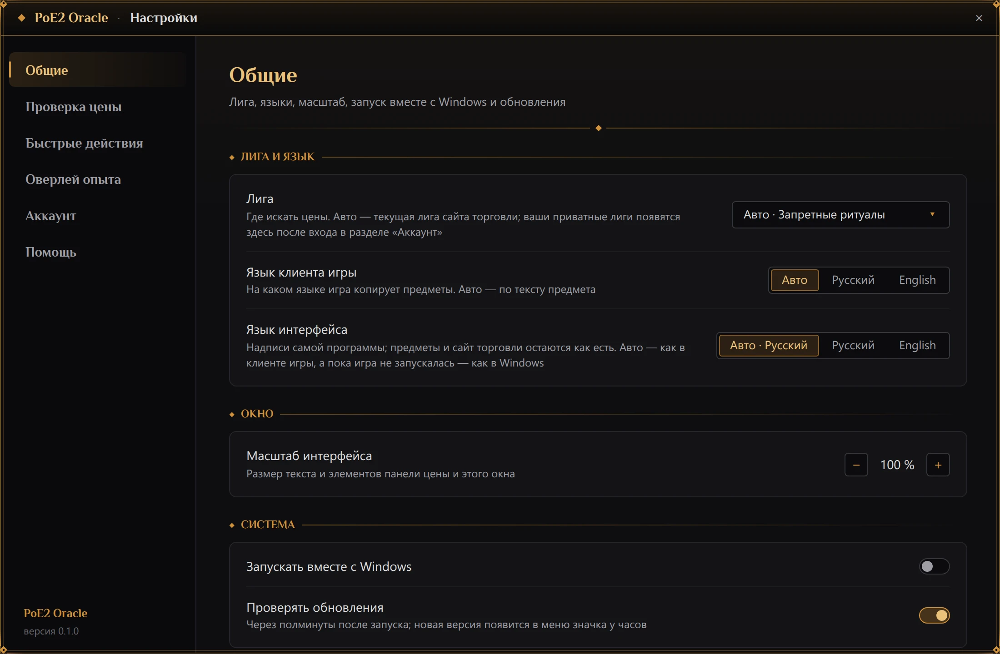

# Настройки

Настройки открываются тремя способами:

- меню значка в трее → «Настройки»;
- шестерёнка **⚙** на панели цены;
- повторный запуск PoE2 Oracle, когда он уже работает: запущенная копия откроет свои настройки.

Если окно настроек уже открыто, любой из этих способов выводит его вперёд.

Окно открывается посередине монитора, на котором идёт игра, и остаётся поверх игры. Его можно
перетащить за заголовок и растянуть за края. Слева — разделы, справа — настройки выбранного
раздела.

Всё, что вы меняете, применяется и сохраняется сразу — кнопок «Сохранить» и «Отмена» нет. Текст в
поле применяется, когда вы нажимаете <kbd>Enter</kbd> или <kbd>Tab</kbd>, щёлкаете в другом месте
или закрываете окно; <kbd>Esc</kbd> в поле возвращает прежний текст. Закрывает окно **×** в
заголовке или <kbd>Esc</kbd>; если открыт список лиг или диалог, <kbd>Esc</kbd> сначала закрывает
его.

Пока окно настроек открыто, панель цены скрыта, а горячая клавиша проверки цены не действует —
чтобы можно было записать новую.

Вверху раздела «Общие», в рамке, — предупреждения со значком **⚠** о том, что мешает проверке цены:
например, полноэкранный режим игры или сочетание копирования, занятое другой программой. См.
[Решение проблем](troubleshooting.md).

## Общие

### Лига

Список лиг, где искать цены:

- «Авто · *лига*» (по умолчанию) — текущая лига сайта торговли, первая в его списке;
- любая лига из списка сайта торговли — под названием, которое сайт даёт ей на языке интерфейса
  (с ru.pathofexile.com для русского, с www.pathofexile.com для английского), как на плашке лиги
  на панели цены;
- «Своя лига · *название*» — приватная лига: каждая лига вашего аккаунта, пока вы вошли на сайт, и
  та, чьё название задано в разделе [«Аккаунт»](#аккаунт).

Пояснения под названием строки: «Список лиг с сайта торговли загружается» или «…не загрузился»;
«Этой лиги больше нет на сайте торговли — поиск идёт в текущей» — выбранная лига закончилась.

### Язык клиента игры

«Авто» (по умолчанию), «Русский» или «English». В режиме «Авто» язык каждого предмета определяется
по скопированному тексту. От языка зависит, как читается текст предмета и на каком сайте торговли
идёт поиск: ru.pathofexile.com для русского клиента, www.pathofexile.com для английского.

### Язык интерфейса

«Авто · *язык*» (по умолчанию), «Русский» или «English» — каждый язык назван на нём самом. Это язык
надписей самой программы: окна настроек, панели цены, оверлеев, меню значка, сообщений, а также
запись чисел (`15,1 %` по-русски, `15.1%` по-английски). То, что приходит из игры и с сайта
торговли, остаётся на своём языке: названия предметов и свойства — как их скопировал клиент,
названия лиг — как их даёт сайт торговли. Смена действует сразу во всех открытых окнах.

«Авто» следует языку клиента игры — его называет файл настроек самой игры, — а пока игра ни разу не
запускалась, языку Windows. В самом варианте написано, какой язык он сейчас означает, например
«Авто · Русский».

От языка интерфейса зависят и страница входа на pathofexile.com (см. [«Аккаунт»](#аккаунт)), язык,
на котором открывается Craft of Exile, и сайт торговли, чьи названия лиг показывают списки лиг.

### Масштаб интерфейса

По умолчанию 100 %, от 80 до 150 % с шагом 5 — кнопками − и +. Меняет размер текста и элементов
панели цены (и её ширину). Оверлей опыта — часть интерфейса игры и берёт его размер; само окно
настроек не масштабируется.

### Система

- «Запускать вместе с Windows» (по умолчанию выключено) — добавляет PoE2 Oracle в автозагрузку
  Windows; та же галочка есть на последней странице установщика. Включение здесь снова разрешает
  автозапуск, даже если его отключили в диспетчере задач.
- «Проверять обновления» (включено по умолчанию) — искать новую версию через 30 секунд после
  запуска. Пункт обновления в меню значка работает в любом случае. См.
  [Обновления и удаление](updates.md).

## Проверка цены

### Горячая клавиша

Строка «Проверка цены». Щёлкните по полю с клавишами и нажмите новое сочетание — оно сразу
начинает работать. <kbd>Esc</kbd> или повторный щелчок по полю оставят прежнее.

Подходят <kbd>Ctrl</kbd> или <kbd>Alt</kbd> (можно вместе с <kbd>Shift</kbd>) с буквой A–Z или
цифрой 0–9, а также <kbd>F1</kbd>–<kbd>F12</kbd> — отдельно или с модификаторами. Буквы — это
физические клавиши: <kbd>Ctrl</kbd>+<kbd>E</kbd> остаётся той же клавишей и в русской раскладке.
Неподходящее сочетание поле не примет и объяснит почему:

| Сообщение | Причина |
|---|---|
| «Буквам и цифрам нужен Ctrl или Alt — иначе клавиша перестанет печататься» | Без Ctrl или Alt буква или цифра перестала бы печататься во всех программах |
| «Ctrl+C занято: этим сочетанием программа копирует предмет» | Через Ctrl+C копируется предмет |
| «Alt+F4 закрывает окна, в том числе игру» | Alt+F4 закрывает окна, и игру тоже |
| «Сочетания с клавишей Win не поддерживаются» | Сочетания с клавишей Windows не поддерживаются |
| «Подходят только буквы A–Z, цифры 0–9 и F1–F12» | Другие клавиши не подходят |
| «Это сочетание уже у другого быстрого действия» | Сочетание уже занято быстрым действием |

Если сочетание уже занято другой программой, под полем появится, например, «F7 занято другой
программой — осталось Ctrl+E», и прежняя клавиша продолжит работать. Действующая клавиша всегда
видна в подсказке значка в трее.

### Поиск

- «Продавцы по умолчанию» — каких продавцов ищет каждая новая проверка: «Мгновенный выкуп» (по
  умолчанию; покупка проходит в игре, продавцу не нужно быть в сети), «Выкуп и онлайн», «Онлайн»
  или «Все», включая офлайн. Плашка «Продавцы:» на панели по-прежнему меняет это для отдельного
  предмета. Если в настройках от прежней версии осталось её значение по умолчанию «выкуп и
  онлайн», оно один раз сменится на мгновенный выкуп; дальше ваш выбор сохраняется.
- «Колонка продавца» (включена по умолчанию) — имя продавца в таблице результатов.

### Путевые камни

«Пометки модификаторов» — сколько свойств путевых камней вы пометили на панели цены (см.
[Путевые камни](price-check.md#путевые-камни)). Кнопка «Сбросить…» удаляет все пометки, но сначала
спрашивает: «Сбросить пометки?». «Сбросить» удаляет их, «Отмена», <kbd>Esc</kbd> или щелчок мимо
окошка — оставляет.

## Быстрые действия

Клавиши, которые печатают в игру команды чата или строку поиска в тайнике: у каждого действия вид
(«Чат» или «Тайник»), текст, клавиша и **×**, а внизу — «+ Добавить действие». См.
[Быстрые действия](quick-actions.md).

## Оверлей опыта

Что показывает оверлей — см. [Оверлей опыта](xp-overlay.md).

| Настройка | По умолчанию | Что делает |
|---|---|---|
| «Показывать оверлей опыта» | вкл. | Скорость набора опыта и время до следующего уровня над панелью флаконов |
| «Процент уровня» | выкл. | Ещё и сколько текущего уровня уже набрано |
| «Таймер карты» | вкл. | Время в текущей карте, опыт за неё и среднее время карты за сессию — над панелью умений |
| «Сглаживание скорости» | 10 мин | 5, 10, 20 или 30 минут. Короче — быстрее видна смена фарма, длиннее — ровнее |

## Аккаунт

Вход на pathofexile.com нужен для поиска в приватных лигах и для строк «сумма» среди
[фильтров](price-check.md#фильтры).

- **pathofexile.com.** Строка показывает, что известно о входе: «Войдите в открывшемся окне», пока
  открыто окно входа, «Вход не выполнен», «Проверяю вход…», «Вы вошли как *аккаунт*» (или просто
  «Вы вошли», если страница сайта не называет аккаунт), «Сессия истекла» — сайт больше не
  принимает этот вход — или «Не удалось проверить вход», когда сайт не ответил: тогда сессия
  используется как есть. «Войти» открывает страницу входа pathofexile.com в окне программы, на
  языке интерфейса (ru.pathofexile.com для русского, www.pathofexile.com для английского; сессия у
  них общая): войдите как обычно, в том числе через Steam, — после входа окно закроется само.
  Сессия хранится в диспетчере учётных данных Windows и отправляется только на pathofexile.com.
  «Выйти» забывает сессию в PoE2 Oracle; на сайте вы остаётесь в системе. Для окна входа нужен
  Microsoft Edge WebView2 Runtime; если его нет, под строкой будет ссылка
  «Скачать с сайта Microsoft».
- **Приватная лига.** Со входом ничего вводить не нужно: меню лиг — в разделе «Общие» и на панели
  цены — предлагают приватные лиги вашего аккаунта, как их показывает страница «Приватные лиги» на
  pathofexile.com, а строка их называет. Для другой лиги — «Название лиги»: как на pathofexile.com,
  `My League`. Когда вы нажимаете <kbd>Enter</kbd> или уходите из поля, программа находит лигу на
  сайте и берёт название, как его пишет сайт, с номером — `My League (PL12345)`; поиск переходит в
  эту лигу, а меню лиг с этих пор предлагает её как «Своя лига · *название*», даже пока вы ищете в
  другой лиге: вернуться в неё — один щелчок. Название, которого на сайте нет, ничего не меняет, и
  строка об этом скажет. Пустое поле её забывает и возвращает лигу «Авто», если поиск шёл в ней.
  Без входа сайт не отвечает на поиск в приватной лиге — строка об этом предупредит. Цены биржи
  берутся из публичной лиги, на которой сделана ваша: см.
  [В приватной лиге](price-check.md#в-приватной-лиге).

## Помощь

- «Обучение» → «Пройти заново» — ещё раз показывает короткий тур по программе: настройки и лига,
  проверка цены, панель цены и оверлей опыта, по одному.
- «Сообщить об ошибке»:
  - «Сообщить ↗» — то же, что одноимённый пункт меню значка: сохраняет отчёт для разработчика на
    рабочий стол, показывает его в проводнике и открывает в браузере форму сообщения об ошибке на
    GitHub. См. [Сообщить об ошибке](troubleshooting.md#сообщить-об-ошибке).
  - «Собрать отчёт» — только сохраняет отчёт: архив с логами, настройками и текстами предметов,
    которые программа не смогла прочитать, на рабочем столе, и показывает его в проводнике. Имя
    пользователя Windows, если в нём от трёх символов, в архиве скрыто. См.
    [Отчёт для разработчика](troubleshooting.md#отчёт-для-разработчика).
- «Папка логов» → «Открыть» — открывает папку с логами этого запуска и предыдущего.
- «О программе» — версия и лицензия PoE2 Oracle. «Лицензии» открывает `THIRD-PARTY-NOTICES.html`,
  который установщик кладёт рядом с программой, — лицензии всего, что в неё входит. «GitHub ↗» —
  страница проекта.

## Где хранятся настройки

`%APPDATA%\poe2-oracle\config\settings.json` — вместе с пометками путевых камней и быстрыми
действиями. Если файл однажды не удастся прочитать, PoE2 Oracle переименует его в
`settings.json.bak` и начнёт с настроек по умолчанию.
