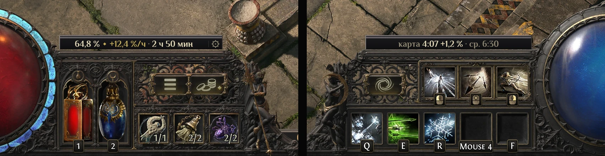

# Оверлей опыта



PoE2 Oracle ставит показатели опыта поверх интерфейса игры. На планке вдоль верха панели
флаконов, слева от полосы опыта, стоит плашка о том, как быстро вы набираете опыт и когда будет
следующий уровень, а в её конце ⚙, которая открывает [настройки](settings.md). С таймером карты
такая же плашка на планке панели умений показывает текущую карту. Плашки стоят на планках, но не
закрывают их — в планках игра показывает ярость и оглушение, — и нарисованы попиксельно в лепнине
и цветах самого интерфейса. Внешним концом каждая плашка доходит до рамки своей сферы, здоровья
или маны, и закрывает зазор перед ней точно по пикселям, а внутренним плавно загибается вниз, на
кончик завитка игры. Оверлей включён по умолчанию; его и его части включают и выключают в разделе
[«Оверлей опыта»](settings.md#оверлей-опыта) настроек.

Над панелью флаконов:

```text
64,8 % ◆ +12,4 %/ч · до 75 ур. 1 ч 32 мин
```

Над панелью умений:

```text
карта 4:07 +1,2 % · ср. 6:30
```

| Часть | Что значит |
|---|---|
| `64,8 %` | Сколько текущего уровня уже набрано. Видна с настройкой «Процент уровня» (по умолчанию выключена) и всегда — на паузе. |
| `+12,4 %/ч` | Опыт в час игры — в процентах текущего уровня. |
| `до 75 ур. 1 ч 32 мин` | Сколько игры при такой скорости осталось до 75 уровня. «до ур.» — пока уровень персонажа неизвестен; «—» — когда оценить нельзя. |
| `карта 4:07 +1,2 %` | Время в текущей карте и опыт за неё. Видно с настройкой «Таймер карты» (по умолчанию включена). Когда вы выходите из карты, тускнеет, а через пять минут становится «последней картой». |
| `ср. 6:30` | Среднее время карт, пройденных за сессию. |

Каждая строка говорит столько, сколько помещается на её плашке. Если целиком не входит, строка над
панелью флаконов сначала убирает уровень (`64,8 % ◆ +12,4 %/ч · 1 ч 32 мин`), потом процент
(`+12,4 %/ч · 1 ч 32 мин`); строка карты убирает среднее время и слово «последняя». Первые пару
минут в строке написано «замер скорости…».

В городе или убежище, а в игре — после пяти минут без опыта и без смены локации строка тускнеет и
показывает только, сколько уровня набрано, даже с выключенным «Процентом уровня»: скорость и время
до уровня остались бы от игры до паузы.

```text
64,8 %
```

Строка карты убирает среднее время. В городе или убежище она показывает карту, из которой вы
вышли, тусклой, а на паузе внутри самой карты остаётся яркой, и время карты идёт. Скорость от
паузы не меняется: когда вы снова играете, она прежняя.

## Как это работает

- Каждые две секунды PoE2 Oracle смотрит прямо на экран, насколько заполнена полоса опыта, и
  читает журнал игры (`Client.txt`): повышения уровня, смену локаций и выходы к выбору персонажа.
  Пока игра за другим окном, опыт не идёт, и на полосу программа смотрит лишь раз в десять секунд,
  а через две — если прошлый взгляд заметил в ней перемену или не смог её прочесть. Если программу
  запустить посреди игры, она прочтёт журнал назад, со временем каждой строки: уровень персонажа,
  карту, в которой вы сейчас или из которой вышли, с её временем, и сколько вы уже в городе или
  убежище. Не учитывается только карта, начатая раньше прочитанного конца журнала: её начала в нём
  нет. После перезапуска ради обновления оверлей не начинает заново: скорость, время до уровня и
  таймер карты идут дальше, как шли.
- Скорость сильнее учитывает недавнюю игру. При «Сглаживании скорости» 10 минут (по умолчанию)
  игра десятиминутной давности весит вдвое меньше, чем игра сейчас. 5 минут — быстрее видна смена
  фарма, 20 или 30 — число ровнее.
- Время в городах и убежищах в скорость не входит. Новый уровень скорость не сбрасывает, смерть
  тоже: опыт за смерть теряется, скорость остаётся.
- Таймер карты встаёт на паузу (становится тусклым), когда вы выходите из карты, и идёт дальше,
  когда вы возвращаетесь в ту же карту через портал, — даже если она уже «последняя». Карта
  считается пройденной, когда вы входите в другую карту, — выполнили вы её или нет. Выход к выбору
  персонажа начинает всё заново, ведь вернуться можно и другим персонажем: скорость (снова «замер
  скорости…»), уровень («до ур.», пока персонаж не получит новый уровень) и статистику карт.
- Испытания восхождения (Испытание Сехем и Испытание Хаоса) к карте не относятся никогда, но в
  скорость идут, как любая игра.
- Если полоса дольше нескольких секунд чем-то закрыта (экраном загрузки, деревом пассивных умений,
  панелью цены), это время считается, только когда за него прибавился опыт — например, в бою с
  открытой панелью цены — и полоса вернулась меньше чем через минуту; иначе не считаются ни это
  время, ни опыт, набранный за него. Сами плашки следуют за своими планками, а не за полосой: экран
  загрузки или дерево пассивных умений убирают их вместе с интерфейсом игры, а панель цены скрывает
  только ту плашку, над которой стоит (см. [Требования](#требования)).

## Требования

- Окно игры высотой не меньше 720 пикселей и не свёрнутое.
- Режим игры «Оконный» или «Оконный полноэкранный» — как и для всего, что PoE2 Oracle рисует
  поверх игры.
- Размер плашек — как у интерфейса игры при её разрешении; настройка «Масштаб интерфейса» на них
  не влияет. Щелчки они пропускают в игру, кроме ⚙, а панель цены скрывает плашку, только пока
  стоит поверх неё: если панель перетащить туда или если она сама достаёт до плашки (окно игры 4:3
  или 5:4, крупный «Масштаб интерфейса»). Пока игра на переднем плане, плашка сразу уходит, когда
  планку закрывает подсказка, чат или другая часть интерфейса игры, и сразу возвращается, как
  только планка снова видна. То, что игра показывает поверх планки, пока вы не трогаете ни мышь, ни
  клавиатуру, — например экран загрузки, который появляется через некоторое время после щелчка, —
  убирает плашку в пределах двух секунд. За другим окном игра тоже показывает подсказку под
  курсором; тогда плашка уходит в пределах четырёх секунд и возвращается в пределах двух.
